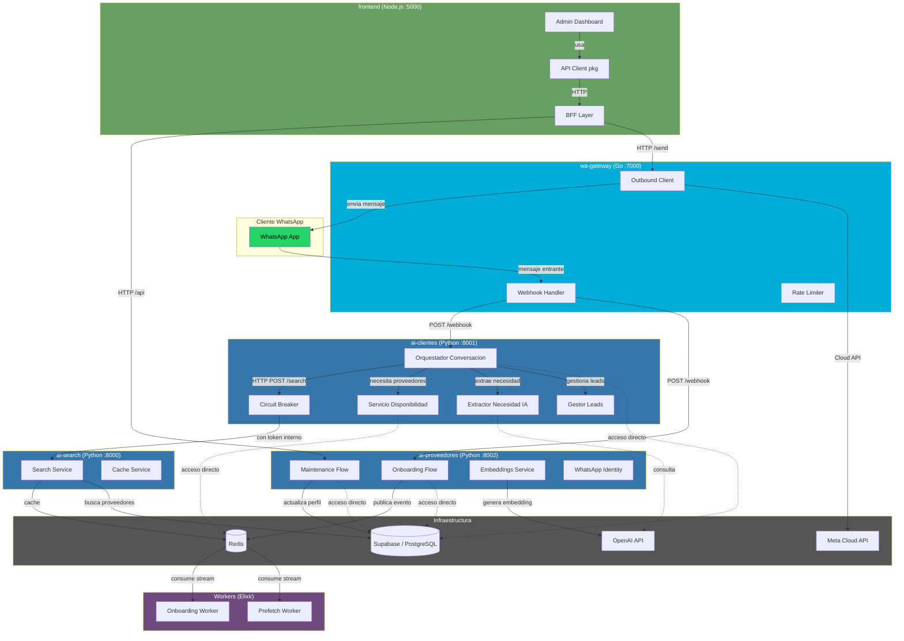

# Auditoria de Arquitectura — TinkuBot Microservices

**Fecha:** 2026-04-15
**Repositorio:** tinkubot-microservices
**Lineas de codigo fuente:** ~120,000 LOC (475 archivos, 4 lenguajes)
**Servicios:** 7 microservicios + infraestructura compartida

---

## 1. Resumen Ejecutivo

TinkuBot es un sistema de intermediacion WhatsApp que conecta clientes con proveedores de servicios. La arquitectura es un **monorepo poliglota** con 7 servicios en Python (FastAPI), Go (Gin), Node.js (Express) y Elixir (OTP), orquestados via Docker Compose sobre Redis y Supabase/PostgreSQL. El sistema demuestra madurez en decisiones clave: interfaces basadas en Protocols (`contracts/`), modelos Pydantic para validacion, Circuit Breaker para resiliencia, y separacion de responsabilidades por lenguaje (Go para el gateway de alto rendimiento, Elixir para workers reactivos, Python para logica de IA).

Sin embargo, la salud arquitectonica presenta **deficiencias significativas**. El antipatron mas critico es la proliferacion de **God Objects**: el peor es `providersManager.ts` con 2,785 lineas, seguido de `disponibilidad.py` (1,268 lineas) y `orquestador_conversacion.py` (1,075 lineas). Estos archivos concentran logica de negocio, acceso a datos, gestion de estado y construccion de mensajes en una sola unidad, violando drasticamente el Principio de Responsabilidad Unica. Ademas, el patron de **imports dinamicos** (`from principal import supabase`) aparece 11 veces en el codigo de produccion como workaround para dependencias circulares, lo cual es un code smell severo que oculta problemas de diseno mas profundos.

El tercer problema estructural es el **acoplamiento excesivo con la base de datos**: 43 archivos acceden directamente a Supabase sin capa de repositorio intermedia, y 14 archivos acceden a Redis de forma directa. Esto hace que cambios en el esquema de datos o en la infraestructura de cache impacten decenas de archivos simultaneamente. La cobertura de testing es desigual: Python cuenta con 259 archivos de test (razonable), pero Go solo tiene 5, TypeScript/JS tiene 4, y Elixir tiene 5, dejando servicios criticos como el gateway y los workers sin proteccion de regresion.

---

## 2. Diagrama de Componentes



**Leyenda:**
- Flechas solidas: comunicacion explicita (HTTP, Redis streams)
- Flechas punteadas: acoplamiento directo a base de datos (antipatron)
- Colores por tecnologia: verde=WhatsApp, azul=Go, azul oscuro=Python, purpura=Elixir, verde claro=Node.js

---

## 3. Antipatrones Encontrados

### 3.1 God Object — Severidad: CRITICA

| Archivo | Lineas | Responsabilidades mezcladas |
|---------|--------|-----------------------------|
| `frontend/apps/.../providersManager.ts` | 2,785 | Estado UI, llamadas API, transformacion de datos, gestion de modales, navegacion |
| `ai-clientes/services/proveedores/disponibilidad.py` | 1,268 | Logica de negocio, queries SQL, cache Redis, construction de mensajes WhatsApp |
| `ai-clientes/services/orquestador_conversacion.py` | 1,075 | Routing de estados, IA, base de datos, coordinacion de servicios |
| `ai-clientes/services/extraccion/extractor_necesidad_ia.py` | 997 | Prompts IA, parsing, normalizacion de texto, validacion geografica |
| `ai-proveedores/flows/maintenance/services_confirmation.py` | 922 | Confirmacion de servicios, IA, base de datos, mensajes |
| `ai-proveedores/flows/maintenance/services.py` | 898 | CRUD servicios, IA clasificacion, Redis, Supabase |
| `ai-clientes/flows/enrutador.py` | 848 | Routing conversacional, logica de estados, branching |
| `ai-search/services/search_service.py` | 797 | Busqueda vectorial, filtros, scoring, fallbacks, cache |

**Impacto:** Cambios en cualquier aspecto de estos archivos requieren entender las otras 10+ responsabilidades. Testeo unitario es virtualmente imposible sin mocks masivos.

### 3.2 Dependencias Circulares (Dynamic Import Workaround) — Severidad: ALTA

```python
# 11 ocurrencias de este patron:
from principal import supabase  # Import dinamico para evitar circular import
```

Archivos afectados:
- `ai-clientes/flows/busqueda_proveedores/ejecutor_busqueda_en_segundo_plano.py`
- `ai-proveedores/flows/maintenance/specialty.py`
- `ai-proveedores/flows/maintenance/services.py`
- `ai-proveedores/services/onboarding/registrador.py`
- `ai-proveedores/services/onboarding/consentimiento.py`
- `ai-proveedores/services/maintenance/actualizar_perfil_profesional.py`
- `ai-proveedores/services/maintenance/actualizar_servicios.py` (3 veces)

**Impacto:** El modulo `principal.py` se convierte en un **Service Locator implicito**. Cualquier refactor de `principal.py` rompe los imports dinamicos en tiempo de ejecucion, no en tiempo de compilacion.

### 3.3 Estado Global (Singletons) — Severidad: ALTA

```python
# ai-proveedores/principal.py
supabase: Optional[Client] = None           # Modulo-level global
cliente_openai: Optional[AsyncOpenAI] = None # Modulo-level global
servicio_embeddings: Optional[...] = None    # Modulo-level global

# ai-clientes/principal.py
supabase = create_client(...)               # Inicializacion directa
cliente_openai = AsyncOpenAI(...)            # Inicializacion directa

# ai-clientes/services/proveedores/disponibilidad.py
servicio_disponibilidad = ServicioDisponibilidad()  # Singleton a nivel de modulo
```

**Impacto:** Imposible inyectar dependencias para testing. Imposible ejecutar multiples instancias con configuraciones diferentes. Acoplamiento temporal (orden de inicializacion importa).

### 3.4 Duplicacion de Codigo — Severidad: MEDIA

| Elemento duplicado | Ubicaciones |
|-------------------|-------------|
| Cliente Redis | `ai-clientes/infrastructure/persistencia/cliente_redis.py` y `ai-proveedores/infrastructure/redis/cliente_redis.py` |
| Normalizacion de texto | `orquestador_conversacion.py`, `manejo_servicio.py`, `utils/texto.py` |
| Sinonimos de ciudades | `orquestador_conversacion.py` y `extractor_necesidad_ia.py` (diccionario identico) |
| Configuracion con os.getenv | ~50+ llamadas `os.getenv()` dispersas en vez de usar `ConfiguracionServicio` centralizado |
| Patrones de respuesta WhatsApp | Repetidos en `templates/` de ambos servicios |

### 3.5 Falta de Capa de Datos (Repository Pattern incompleto) — Severidad: ALTA

```
Archivos con acceso directo a Supabase: 43
Archivos con acceso directo a Redis: 14
```

Los servicios `ai-clientes` definen interfaces (`contracts/repositorios.py`) pero las implementaciones se bypassean en la practica: archivos como `disponibilidad.py`, `gestor_leads.py` y `orquestador_conversacion.py` acceden a `supabase` directamente sin pasar por el repositorio.

### 3.6 Type Safety debil en Frontend — Severidad: MEDIA

```typescript
// Uso de 'any' que socava TypeScript
window as typeof window & { bootstrap?: { Modal?: any } }
return (cuerpo as T) ?? (null as T);  // Type assertions inseguras
```

El archivo `providersManager.ts` (2,785 lineas) gestiona estado con objetos literales tipados debilmente en vez de usar un gestor de estado tipado (Zustand, Jotai, o incluso Redux).

### 3.7 Manejo de Errores Inconsistente — Severidad: MEDIA

- Solo 2 clases de excepcion personalizadas en todo el codigo Python
- Patron recurrente: `except Exception as e: logger.error(f"Error: {e}")` que pierde contexto
- Sin jerarquia de excepciones de dominio (ej. `ProveedorNoEncontradoError`, `BusquedaVaciaError`)
- El servicio Go no propaga errores con codigos semanticos consistentes

### 3.8 Mezcla de Capas en Route Handlers — Severidad: MEDIA

Los endpoints de `ai-proveedores` (`routes/`) y los handlers del `BFF` (`nodejs-services/frontend/bff/providers.js`) mezclan:
- Parsing de request
- Logica de negocio
- Acceso a base de datos
- Construccion de respuesta HTTP

Sin capas claras de Controller → Service → Repository.

---

## 4. Analisis de Acoplamiento y Cohesion

### 4.1 Mapa de Acoplamiento por Servicio

#### ai-clientes (Python) — Cohesion: MEDIA-BAJA

```
Nivel de acoplamiento:
  orquestador_conversacion.py <---> 12 dependencias directas
  disponibilidad.py <---> 8 dependencias directas
  extractor_necesidad_ia.py <---> 6 dependencias directas

Problema: El orquestador conoce TOO el sistema.
Conoce: base de datos, Redis, IA, search service, leads, sesiones.
Deberia: orquestar delegando a servicios especializados.
```

**Patron positivo:** Las interfaces en `contracts/` (Protocol-based) son correctas y deberian ser el modelo a seguir.

#### ai-proveedores (Python) — Cohesion: BAJA

```
Nivel de acoplamiento:
  principal.py <---> 15+ modulos (todos importan desde aca)
  services/ <---> 43 archivos tocan Supabase directamente

Problema: principal.py es un Hub central.
Todos los caminos pasan por principal.py (imports dinamicos).
Convierte al servicio en un sistema monolitico disfrazado de modular.
```

**Patron positivo:** La separacion `flows/onboarding/` vs `flows/maintenance/` muestra intencion de segregacion.

#### ai-search (Python) — Cohesion: ALTA

```
El servicio mas cohesivo del sistema.
- Responsabilidad unica: busqueda semantica
- 3 modulos claros: api, search_service, cache_service
- Comunicacion via HTTP con token interno
- Buena separacion entre API y logica
```

**Patron a replicar:** Este servicio deberia ser el modelo arquitectonico para los demas.

#### wa-gateway (Go) — Cohesion: ALTA

```
Buena separacion de responsabilidades:
  metawebhook/     → recibir mensajes
  metaoutbound/    → enviar mensajes
  ratelimit/       → limitar tasa
  webhook/         → routing dinamico
```

**Patron positivo:** Estructura interna limpia con paquetes bien delimitados. 913 lineas en `client.go` es el unico archivo grande, pero su complejidad es inherente al protocolo de Meta.

#### frontend (Node.js) — Cohesion: MUY BAJA

```
providersManager.ts (2,785 lineas) concentra:
  - Estado global (20+ variables)
  - Llamadas HTTP (sin capa de servicio separada)
  - Manipulacion del DOM directa
  - Logica de navegacion
  - Logica de presentacion
```

**Patron negativo:** El BFF (`bff/providers.js`) accede tanto a `ai-proveedores` como a `wa-gateway` y a Supabase, mezclando responsabilidades de proxy, negocio y datos.

#### Workers (Elixir) — Cohesion: ALTA

```
Workers limpios y enfocados:
  provider-onboarding-worker → procesa eventos de onboarding
  provider-prefetch-worker   → pre-cachea busquedas
```

### 4.2 Matriz de Acoplamiento Inter-Servicio

```
                wa-gw  ai-cli  ai-prov  ai-search  frontend  workers
wa-gateway        -      W       W        -          W        -
ai-clientes       R      -       -        S          -        -
ai-proveedores    R      -       -        -          R        P
ai-search         -      -       -        -          -        -
frontend          R      -       R        -          -        -
workers           -      -       -        -          -        -

W = Writes (envia datos)  R = Reads (consume datos)
S = Sync call (HTTP)      P = Publishes (Redis streams)
- = Sin conexion directa
```

**Hallazgo:** La comunicacion es mayormente unidireccional y asincrona, lo cual es positivo. Sin embargo, `ai-clientes` y `ai-proveedores` comparten la misma base de datos Supabase sin un esquema de propiedad claro, creando acoplamiento de datos implicito.

### 4.3 Acoplamiento de Datos Compartido

```
                    Supabase (tablas compartidas)
                    ┌─────────────────────────┐
ai-clientes ──────►│ providers (lectura)      │◄────── ai-proveedores (escritura)
ai-clientes ──────►│ conversations (RW)       │
ai-proveedores ──►│ provider_profiles (RW)    │
ai-search ───────►│ providers + embeddings    │
frontend ────────►│ providers (lectura)       │
                    └─────────────────────────┘
```

**Problema:** No existe un contrato de datos entre servicios. Si `ai-proveedores` cambia el esquema de `providers`, `ai-clientes`, `ai-search` y `frontend` se rompen silenciosamente.

---

## 5. Plan de Accion (Roadmap)

### CRITICA — Resolver antes de agregar funcionalidad nueva

1. **Romper God Objects en ai-proveedores**
   - Que mover: Extraer logica de base de datos de `services.py` (898 lineas) y `services_confirmation.py` (922 lineas) a repositorios dedicados
   - Que crear: `repositories/servicio_repository.py`, `repositories/confirmacion_repository.py`
   - Que eliminar: Imports dinamicos de `principal.py` (reemplazar con inyeccion via constructor)

2. **Romper God Object en ai-clientes**
   - Que mover: Extraer acceso a Supabase de `orquestador_conversacion.py` (1,075 lineas) y `disponibilidad.py` (1,268 lineas) hacia los repositorios existentes en `infrastructure/persistencia/`
   - Que crear: `services/proveedores/disponibilidad_repository.py`, `services/leads/leads_repository.py`
   - Que eliminar: Acceso directo a `supabase` desde la capa de servicios (obligar paso por repositorio)

3. **Romper God Object en frontend**
   - Que mover: Separar `providersManager.ts` (2,785 lineas) en: gestor de estado, servicio API, y controladores de UI
   - Que crear: `services/providerService.ts`, `state/providerState.ts`, `controllers/providerController.ts`
   - Que eliminar: Estado mutable directo y type assertions inseguras

4. **Eliminar imports dinamicos de principal.py**
   - Que mover: Los singletons (`supabase`, `cliente_openai`) a un contenedor de dependencias o pasarlos por inyeccion de constructor
   - Que crear: Un modulo `dependencies.py` que inicialice y provea los clientes
   - Que eliminar: Todas las 11 lineas `from principal import supabase`

### ALTA — Resolver en el proximo ciclo de desarrollo

5. **Centralizar acceso a datos con Repository Pattern real**
   - Que mover: Las 43 referencias directas a `supabase` hacia implementaciones de repositorio
   - Que crear: Repositorios para cada dominio (proveedores, conversaciones, leads, sesiones)
   - Que mantener: Las interfaces en `contracts/` ya son correctas

6. **Crear paquete compartido Python para utilidades duplicadas**
   - Que crear: `python-services/shared/` con: `texto.py`, `redis_client.py`, `ciudades.py`
   - Que eliminar: Duplicacion de cliente Redis, normalizacion de texto, sinonimos de ciudades
   - Que mover: Funciones comunes al paquete compartido

7. **Implementar jerarquia de excepciones de dominio**
   - Que crear: `exceptions.py` en cada servicio con clases tipadas (ej. `ProveedorNoEncontradoError`, `ErrorDeValidacion`, `ErrorServicioExterno`)
   - Que mover: Los `except Exception` genericos a handlers especificos
   - Que crear: Middleware de errores FastAPI centralizado

8. **Unificar configuracion con BaseSettings**
   - Que mover: Las ~50+ llamadas `os.getenv()` dispersas a las clases `ConfiguracionServicio` existentes
   - Que eliminar: Valores hardcoded (URLs de Nominatim, defaults dispersos)
   - Que mantener: El patron `ConfiguracionServicio(BaseSettings)` ya existente es correcto

### MEDIA — Resolver en iteraciones futuras

9. **Aumentar cobertura de tests en Go y Elixir**
   - `wa-gateway`: 5 tests para 11 archivos de produccion es insuficiente
   - Workers Elixir: 5 tests para 21 archivos es insuficiente
   - Objetivo: cubrir al menos los flujos criticos (webhook reception, message sending)

10. **Agregar contratos de datos entre servicios**
    - Que crear: Schemas compartidos o documentacion OpenAPI que defina los contratos entre servicios
    - Que implementar: Tests de contrato que validen que los servicios respetan los schemas
    - Objetivo: Detectar breaking changes entre servicios automaticamente

11. **Mejorar type safety en frontend**
    - Que eliminar: Todos los usos de `any` en TypeScript
    - Que crear: Tipos de dominio explicitos para cada entidad
    - Que implementar: Zod o similar para validacion en runtime

12. **Implementar capa de DTOs/Mappers en ai-proveedores**
    - Que crear: `dto/` con clases de transferencia entre capas
    - Que crear: `mappers/` para convertir entre entidades de BD y DTOs
    - Objetivo: Aislar cambios de esquema de BD de la capa de API

### BAJA — Mejoras de calidad de vida

13. **Implementar observabilidad centralizada**
    - Agregar structured logging consistente en todos los servicios
    - Implementar tracing distribuido (correlation IDs entre servicios)
    - Dashboards de salud por servicio

14. **Evaluar service mesh o API gateway dedicado**
    - Actualmente la autenticacion inter-servicio es por token estatico
    - Considerar un API gateway para centralizar routing, auth y rate limiting

15. **Documentar decisiones arquitectonicas (ADRs)**
    - Que crear: `docs/adr/` con registros de decisiones clave
    - Documentar: Por que Elixir para workers, por que Go para gateway, por que Redis streams vs message queue dedicada

---

## Anexo: Patrones Positivos a Preservar

Estos patrones demuestran madurez arquitectonica y deben ser **preservados y replicados** durante cualquier refactor:

| Patron | Ubicacion | Por que es bueno |
|--------|-----------|-----------------|
| Protocol-based interfaces | `ai-clientes/contracts/` | Permite testing con mocks naturales, respeta DIP |
| Circuit Breaker | `ai-clientes/infrastructure/resilience/` | Proteccion contra cascading failures |
| Pydantic models | Todos los servicios Python | Validacion automatica, serializacion segura |
| BaseSettings config | `ai-clientes/config/`, `ai-proveedores/config/` | Configuracion tipada con validacion |
| Rate Limiting | `wa-gateway/internal/ratelimit/` | Proteccion contra abuso |
| Redis Streams para async | `ai-proveedores` → Workers | Desacoplamiento temporal entre servicios |
| Docker Compose health checks | `docker-compose.yml` | Deteccion automatica de fallos |
| Estructura limpia de ai-search | `ai-search/` | **Modelo a replicar** en otros servicios |
