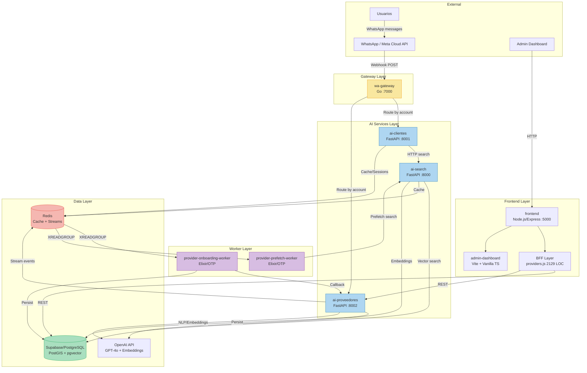
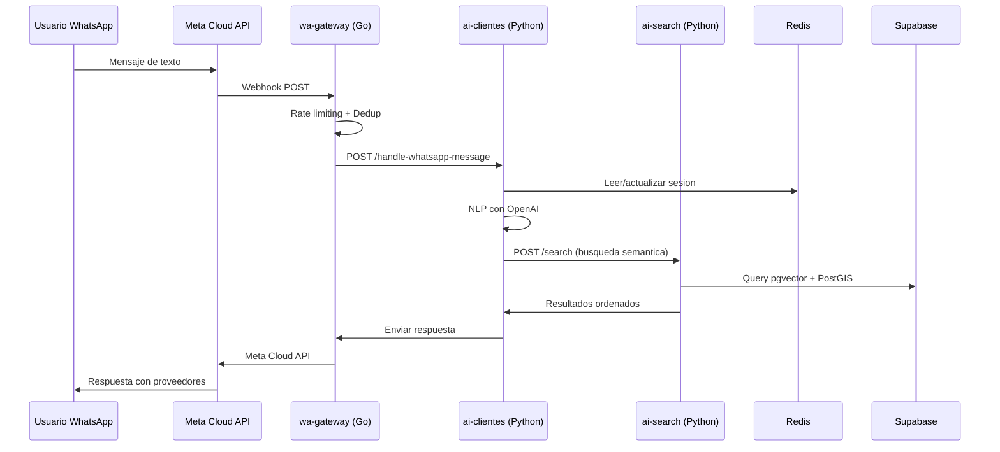
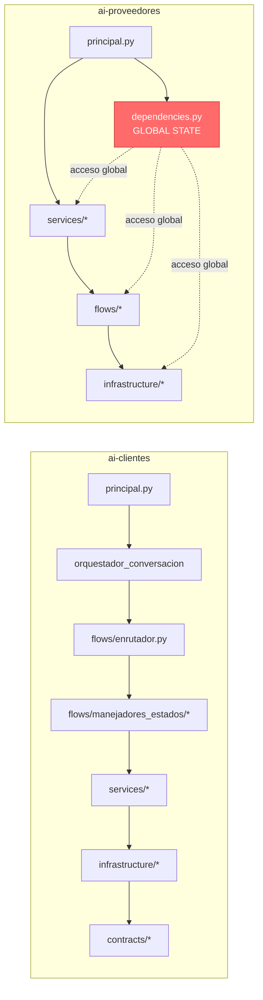
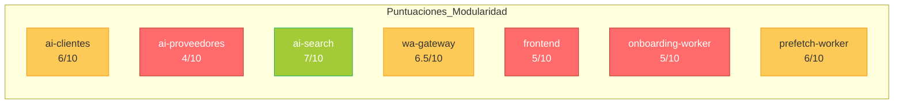

# Auditoria Arquitectonica - TinkuBot Microservices

**Fecha:** 2026-04-16
**Alcance:** Analisis exhaustivo de 7 microservicios en 4 lenguajes (Python, Go, Node.js, Elixir)
**Lineas de codigo analizadas:** ~83,884 (Python: ~68,918 | Go: ~6,175 | Node.js: ~8,714 | Elixir: ~2,177)

---

## Resumen Ejecutivo

| Dimension | Puntuacion |
|-----------|-----------|
| Separacion de Conceptos | 5/10 |
| Flujo de Dependencias | 6/10 |
| Anti-patrones | 4/10 |
| Modularidad Promedio | 5.4/10 |
| Infraestructura y Seguridad | 3/10 |
| **Puntuacion Global** | **4.6/10** |

### Hallazgos por Severidad

| Severidad | Cantidad |
|-----------|----------|
| Critica | 12 |
| Alta | 15 |
| Media | 18 |
| Baja | 8 |

---

## Diagrama de Arquitectura



### Flujo de Datos Principal



---

## 1. Separacion de Conceptos

### 1.1 Evaluacion General

El proyecto sigue una arquitectura de **microservicios por lenguaje** con separacion fisica clara en directorios (`python-services/`, `go-services/`, `nodejs-services/`, `elixir-services/`). Sin embargo, la separacion logica dentro de cada servicio varia significativamente.

| Servicio | Patron | Evaluacion |
|----------|--------|------------|
| ai-clientes | Clean Architecture parcial | Contratos definidos pero lógica de negocio filtra a la capa HTTP |
| ai-proveedores | Capas planas | `principal.py` mezcla handlers, modelos y logica de negocio |
| ai-search | MVC simplificado | Mejor separacion, pero search_service.py acumula responsabilidades |
| wa-gateway | Package-by-feature | Buena separacion pero main.go es un God Function |
| frontend | BFF + Dashboard | BFF monolitico (2,129 LOC en un archivo) |
| Elixir workers | OTP GenServer | Buena estructura pero Processor.es es un God Module |

### 1.2 Hallazgos Criticos

#### H-1.1: God Object en `ai-clientes/flows/enrutador.py`
- **Ubicacion:** `python-services/ai-clientes/flows/enrutador.py` (857 lineas)
- **Severidad:** CRITICA
- **Riesgo:** La funcion `manejar_mensaje()` y `enrutar_estado()` gestionan deteccion de timeout, enrutamiento de estado, normalizacion de mensajes y gestion de sesion. Cambios en cualquier area rompen las demas.
- **Remediacion:**
  ```python
  # ANTES: Todo en enrutador.py
  async def manejar_mensaje(flujo, estado_actual, mensaje):
      # timeout detection (130 lineas)
      # state routing (530 lineas)
      # message normalization
      # session management

  # DESPUES: Separar en componentes
  class ServicioTimeout:
      async def detectar(self, flujo, estado) -> Optional[str]:

  class ManejadorEstado(ABC):
      @abstractmethod
      async def manejar(self, contexto: ContextoConversacion) -> Respuesta:

  class EnrutadorEstados:
      def __init__(self, handlers: Dict[str, ManejadorEstado]):
          self._handlers = handlers
      async def enrutar(self, estado: str, contexto) -> Respuesta:
          return await self._handlers[estado].manejar(contexto)
  ```

#### H-1.2: God Object en `ai-proveedores/principal.py`
- **Ubicacion:** `python-services/ai-proveedores/principal.py` (726 lineas)
- **Severidad:** CRITICA
- **Riesgo:** Contiene handlers HTTP (lineas 253-710), modelos Pydantic (lineas 80-160), logica de negocio (lineas 218-251) y gestion de ciclo de vida (lineas 165-202).
- **Remediacion:**
  ```python
  # ANTES: principal.py tiene todo
  # Lineas 1-726: handlers + models + business logic + lifecycle

  # DESPUES: Separar en modulos
  # api/handlers.py - HTTP handlers
  # api/models.py   - Pydantic schemas
  # principal.py    - Solo lifecycle (app factory, startup, shutdown)
  ```

#### H-1.3: God Object en `frontend/bff/providers.js`
- **Ubicacion:** `nodejs-services/frontend/bff/providers.js` (2,129 lineas)
- **Severidad:** CRITICA
- **Riesgo:** Un solo archivo maneja normalizacion de datos (lineas 416-647), mensajeria WhatsApp (lineas 355-386), integracion Supabase, validacion de negocio, calculos de monetizacion y firma de URLs.
- **Remediacion:**
  ```javascript
  // ANTES: providers.js (2129 lineas)
  // DESPUES: Estructura modular
  bff/providers/
    data-normalizer.js    // normalizarProveedorSupabase
    supabase-client.js    // queries Supabase
    whatsapp-notifier.js  // envio de mensajes
    business-rules.js     // logica de negocio
    monetization.js       // calculos de leads/wallet
    url-signer.js         // firma de URLs
    index.js              // orquestador
  ```

#### H-1.4: God Module en Elixir `processor.ex`
- **Ubicacion:** `elixir-services/provider-onboarding-worker/lib/provider_onboarding_worker/processor.ex` (525 lineas)
- **Severidad:** ALTA
- **Riesgo:** El modulo Processor maneja routing de eventos, persistencia, llamadas a APIs externas, transformacion de datos, procesamiento de imagenes y normalizacion de strings.
- **Remediacion:**
  ```elixir
  # DESPUES: Modulos enfocados
  ProviderOnboardingWorker.Processor.Dispatcher
  ProviderOnboardingWorker.Processor.Consent
  ProviderOnboardingWorker.Processor.Services
  ProviderOnboardingWorker.Processor.Documents
  ProviderOnboardingWorker.Processor.City
  ```

---

## 2. Flujo de Dependencias

### 2.1 Diagrama de Dependencias



### 2.2 Hallazgos

#### H-2.1: Estado Mutable Global en `ai-proveedores/dependencies.py`
- **Ubicacion:** `python-services/ai-proveedores/dependencies.py`
- **Severidad:** CRITICA
- **Riesgo:** `deps = DependenciasServicio()` es un singleton mutable accesible desde todo el codigo. Inicializacion implicita, race conditions potenciales, imposible testear en aislamiento.
- **Remediacion:**
  ```python
  # ANTES: Estado global
  deps = DependenciasServicio()  # accedido desde todo el codebase

  # DESPUES: Inyeccion de dependencias con FastAPI
  from fastapi import Depends

  def get_supabase() -> Client:
      return create_client(...)

  @app.post("/endpoint")
  async def endpoint(
      supabase: Client = Depends(get_supabase),
      embeddings: ServicioEmbeddings = Depends(get_embeddings)
  ):
      ...
  ```

#### H-2.2: Logica de Negocio en Capa HTTP
- **Ubicacion:** `python-services/ai-clientes/principal.py` lineas 277-328
- **Severidad:** ALTA
- **Riesgo:** `handle_whatsapp_message()` contiene logica de deduplicacion (289-305), gestion de locks (307-318) y normalizacion de respuestas (320). Las reglas de negocio estan acopladas a HTTP.
- **Remediacion:**
  ```python
  # DESPUES: Capa de aplicacion separada
  class ProcesadorMensajesWhatsApp:
      async def procesar(self, mensaje: MensajeWhatsApp) -> RespuestaWhatsApp:
          # deduplicacion, locking, normalizacion aqui

  @app.post("/handle-whatsapp-message")
  async def handle_whatsapp_message(payload: dict):
      return await procesador.procesar(MensajeWhatsApp(**payload))
  ```

#### H-2.3: Codigo Duplicado entre Servicios Python
- **Archivos:**
  - `python-services/ai-clientes/flows/enrutador.py`
  - `python-services/ai-proveedores/services/shared/orquestacion_whatsapp.py`
- **Severidad:** ALTA
- **Riesgo:** Logica similar de procesamiento de mensajes, deduplicacion, normalizacion de telefonos y extraccion de ubicacion. Cambios deben hacerse en multiples sitios, comportamiento inconsistente.
- **Remediacion:**
  ```python
  # Crear paquete compartido
  python-services/shared/
    whatsapp/
      normalizador.py
      deduplicador.py
      extractor_ubicacion.py
    config/
      base.py  # ConfiguracionBase compartida
  ```

#### H-2.4: Duplicacion 85% entre Workers Elixir
- **Archivos:**
  - `elixir-services/provider-onboarding-worker/lib/.../worker.ex` (352 lineas)
  - `elixir-services/provider-prefetch-worker/lib/.../worker.ex` (262 lineas)
- **Severidad:** ALTA
- **Riesgo:** Funciones identicas: `init/1`, `handle_info(:boot/:poll/:claim)`, `ensure_group/1`, `read_new_messages/1`, `claim_pending_messages/1`, `parse_stream_reply/1`, `maybe_skip_processed/2`. Bugs deben corregirse en dos sitios.
- **Remediacion:** Extraer libreria compartida `stream_worker_core`.

#### H-2.5: Acoplamiento Frontend -> Backend
- **Ubicacion:** `nodejs-services/frontend/bff/providers.js` lineas 37-58
- **Severidad:** MEDIA
- **Riesgo:** URLs de servicios backend hardcodeadas con defaults. El BFF conoce detalles de implementacion de Supabase (queries REST directas en lineas 899-923).
- **Remediacion:** Introducir patron Repository y clientes de servicio tipados.

---

## 3. Anti-patrones Identificados

### 3.1 God Objects/Functions

| # | Ubicacion | Lineas | Severidad |
|---|-----------|--------|-----------|
| 1 | `nodejs-services/frontend/bff/providers.js` | 2,129 | CRITICA |
| 2 | `python-services/ai-clientes/flows/enrutador.py` | 857 | CRITICA |
| 3 | `python-services/ai-proveedores/principal.py` | 726 | CRITICA |
| 4 | `go-services/wa-gateway/cmd/wa-gateway/main.go` | 308 | ALTA |
| 5 | `python-services/ai-search/services/search_service.py` | 797 | MEDIA |
| 6 | `elixir-services/.../processor.ex` | 525 | ALTA |
| 7 | `nodejs-services/frontend/bff/providers.js:416-647` | 231 | ALTA |

#### H-3.1: God Function en Go `main.go`
- **Ubicacion:** `go-services/wa-gateway/cmd/wa-gateway/main.go` lineas 24-238
- **Severidad:** ALTA
- **Riesgo:** `main()` tiene 215 lineas que manejan parsing de env vars (31-90), validacion (92-140), wiring de dependencias (142-184), inicio del servidor (190-220) y shutdown graceful (222-238).
- **Remediacion:**
  ```go
  // ANTES: main() hace todo
  func main() {
      // 215 lineas de inicializacion, validacion, wiring, startup
  }

  // DESPUES: Paquete bootstrap
  // cmd/wa-gateway/bootstrap/config.go
  type Config struct { Server, Meta, Webhook, RateLimit }
  func LoadConfig() (*Config, error) { ... }

  // cmd/wa-gateway/bootstrap/server.go
  func BuildServer(cfg *Config) (*http.Server, error) { ... }

  // cmd/wa-gateway/main.go
  func main() {
      cfg := bootstrap.LoadConfig()
      srv := bootstrap.BuildServer(cfg)
      bootstrap.SetupGracefulShutdown(srv)
  }
  ```

### 3.2 Spaghetti Code y Acoplamiento

#### H-3.2: `sync.Map` sin limite en Go
- **Ubicacion:** `go-services/wa-gateway/internal/metawebhook/service.go` linea 67
- **Severidad:** ALTA
- **Riesgo:** `seenMessages sync.Map` crece indefinidamente bajo carga alta, causando OOM. Se pierde todo al reiniciar (mensajes duplicados).
- **Remediacion:** Usar cache LRU o Redis con TTL para deduplicacion distribuida.

#### H-3.3: Cuentas Hardcodeadas en Go
- **Ubicacion:** `go-services/wa-gateway/cmd/wa-gateway/main.go` lineas 103-112, 122-130
- **Severidad:** ALTA
- **Riesgo:** IDs de cuenta `bot-clientes` y `bot-proveedores` hardcodeados. No se pueden agregar cuentas sin cambiar codigo y redesplegar.
- **Remedi:** Cargar configuracion de cuentas desde archivo o base de datos.

#### H-3.4: Valores Magicos en Scoring
- **Ubicacion:** `python-services/ai-search/services/search_service.py` lineas 293-298
- **Severidad:** MEDIA
- **Riesgo:** Pesos de scoring hardcodeados (`0.39`, `0.20`, `0.20`). Imposible tunear sin cambiar codigo.
- **Remediacion:** Extraer a `ScoringWeights(BaseSettings)` configurable via env vars.

### 3.3 Falta de Manejo de Errores

#### H-3.5: Fallos Silenciosos en Rate Limiter
- **Ubicacion:** `go-services/wa-gateway/internal/api/handlers.go` lineas 217-220
- **Severidad:** ALTA
- **Riesgo:** Errores del rate limiter se ignoran silenciosamente con `// TODO: add proper logging`.
- **Remediacion:** Agregar logging estructurado y metricas.

#### H-3.6: Stack Traces Perdidos en Elixir
- **Ubicacion:** Ambos workers, bloques `rescue` en `process_entry/2`
- **Severidad:** MEDIA
- **Riesgo:** Solo se captura `Exception.message(error)`, perdiendo el stack trace. Debugging imposible en produccion.
- **Remediacion:**
  ```elixir
  rescue
    error ->
      stack = __STACKTRACE__
      Logger.error("Processor crashed", error: inspect(error), stack: inspect(stack))
  ```

---

## 4. Modularidad

### 4.1 Puntuaciones Detalladas



| Servicio | Cohesion | Acoplamiento | Testabilidad | Reusabilidad | Total |
|----------|----------|-------------|-------------|-------------|-------|
| ai-clientes | 6/10 | 5/10 | 7/10 | 6/10 | **6/10** |
| ai-proveedores | 3/10 | 3/10 | 6/10 | 4/10 | **4/10** |
| ai-search | 7/10 | 7/10 | 7/10 | 7/10 | **7/10** |
| wa-gateway | 7/10 | 6/10 | 8/10 | 5/10 | **6.5/10** |
| frontend | 4/10 | 4/10 | 6/10 | 6/10 | **5/10** |
| onboarding-worker | 5/10 | 5/10 | 3/10 | 4/10 | **5/10** |
| prefetch-worker | 6/10 | 6/10 | 1/10 | 4/10 | **6/10** |

### 4.2 Analisis por Servicio

#### ai-clientes (6/10) - Aceptable con deudas
- **Fortalezas:** Contratos definidos (`contracts/`), patron repositorio parcial, buena estructura de flows con manejadores por estado.
- **Debilidades:** `enrutador.py` como God Object (857 LOC), config dividida en multiples archivos, logica de negocio en capa HTTP.

#### ai-proveedores (4/10) - Deuda tecnica significativa
- **Fortalezas:** Buena cobertura de tests unitarios (30+ archivos), estructura de templates modular.
- **Debilidades:** Estado global mutabl (`dependencies.py`), `principal.py` monolitico (726 LOC), codigo duplicado con ai-clientes, patron repositorio inconsistentemente aplicado.

#### ai-search (7/10) - Mejor arquitecturado
- **Fortalezas:** Estructura limpia (app/api/services/models/utils), endpoints delgados, cache bien implementado.
- **Debilidades:** `search_service.py` algo grande (797 LOC), provider de embeddings tight-coupled a OpenAI, pesos de scoring hardcodeados.

#### wa-gateway (6.5/10) - Buena base, necesita hardening
- **Fortalezas:** Separacion por packages, interfaces para testabilidad, tests excelentes (2,934 lineas).
- **Debilidades:** God function en main.go, sync.Map sin limite, cuentas hardcodeadas, logging no estructurado.

#### frontend (5/10) - Monolito BFF
- **Fortalezas:** Dashboard admin bien organizado con TS, paquete api-client tipado.
- **Debilidades:** `providers.js` de 2,129 lineas, archivos JS sin tipos, sesiones en memoria, sin proteccion CSRF, N+1 queries.

#### Workers Elixir (5-6/10) - Buena estructura OTP, mala reutilizacion
- **Fortalezas:** Patron GenServer correcto, buen manejo de streams Redis.
- **Debilidades:** 85% codigo duplicado entre workers, prefetch worker sin DLQ (perdida de mensajes!), sin circuit breakers,Processor como God Module.

---

## 5. Cuellos de Botella y Riesgos

### 5.1 Riesgos Criticos

#### H-5.1: Perdida de Mensajes en Prefetch Worker
- **Ubicacion:** `elixir-services/provider-prefetch-worker/lib/.../worker.ex` lineas 191-205
- **Severidad:** CRITICA
- **Riesgo:** Cuando falla un prefetch despues de max_attempts, el mensaje se ACK y se pierde permanentemente. El worker de onboarding SI tiene DLQ, el de prefetch NO.
  ```elixir
  # Linea 194-199: Mensaje perdido!
  if attempts >= state.max_attempts do
    Logger.warning("Prefetch descartado tras #{attempts} intentos...")
    ack(event, state)  # Mensaje perdido para siempre
  end
  ```
- **Remediacion:** Implementar DLQ identico al worker de onboarding.

#### H-5.2: `.env` con Secretos Reales en Git
- **Ubicacion:** `/home/du/produccion/tinkubot-microservices/.env`
- **Severidad:** CRITICA
- **Riesgo:** El archivo `.env` contiene credenciales reales de produccion (Supabase service key JWT, URLs de proyecto, connection strings). Si el repo es publico o comprometido, todas las credenciales quedan expuestas.
- **Remediacion:**
  1. **INMEDIATO:** Rotar todas las credenciales comprometidas
  2. Eliminar `.env` del historial de git con `git filter-branch` o BFG Repo-Cleaner
  3. Implementar gestion de secretos (Docker Secrets, Vault, etc.)

#### H-5.3: 5 de 8 Contenedores Corren como Root
- **Ubicacion:**
  - `go-services/wa-gateway/Dockerfile` linea 53
  - `nodejs-services/frontend/Dockerfile` linea 36
  - Ambos Elixir Dockerfiles linea 38
  - `infrastructure-services/message-queue/Dockerfile`
- **Severidad:** CRITICA
- **Riesgo:** Un container escape da acceso root al host. Solo los servicios Python usan `appuser`.
- **Remediacion:**
  ```dockerfile
  # Agregar a TODOS los Dockerfiles antes de CMD
  RUN addgroup -g 10001 appgroup && adduser -u 10001 -G appgroup -D appuser
  USER appuser
  ```

#### H-5.4: Sin Limites de Recursos en Docker Compose
- **Ubicacion:** `docker-compose.yml` - solo `wa-gateway` tiene resource limits (lineas 52-59)
- **Severidad:** CRITICA
- **Riesgo:** Cualquier servicio puede consumir CPU/memoria ilimitada, causando OOM en el host.
- **Remediacion:** Agregar `deploy.resources.limits` a todos los servicios.

#### H-5.5: Redis como Punto Unico de Falla
- **Ubicacion:** `docker-compose.yml` lineas 97-113
- **Severidad:** ALTA
- **Riesgo:** Redis es broker de mensajes (streams para workers), cache de sesiones y cache de busquedas. Si Redis cae: sesiones perdidas, workers sin eventos, busquedas lentas. Ademas: sin password (`REDIS_PASSWORD=` vacio), sin TLS, sin Sentinel/Cluster.
- **Remediacion:**
  1. Implementar Redis Sentinel para alta disponibilidad
  2. Configurar password y TLS
  3. Considerar un broker dedicado para streams criticos

#### H-5.6: Race Condition en Idempotencia
- **Ubicacion:** Ambos Elixir workers, `maybe_skip_processed/2`
- **Severidad:** ALTA
- **Riesgo:** GET + SET no es atomico. Dos workers pueden procesar el mismo evento.
- **Remediacion:** Usar `SET key value NX EX ttl` (operacion atomica).

### 5.2 Cuellos de Botella

#### H-5.7: Lock Contention en Rate Limiter (Go)
- **Ubicacion:** `go-services/wa-gateway/internal/ratelimit/limiter.go` lineas 69, 131
- **Severidad:** ALTA
- **Riesgo:** Mutex global en todas las verificaciones de rate limit se convierte en bottleneck bajo concurrencia alta.
- **Remediacion:** Usar mutexes sharded por cuenta o `sync.Map`.

#### H-5.8: N+1 Queries en Frontend
- **Ubicacion:** `nodejs-services/frontend/bff/providers.js` lineas 716-744
- **Severidad:** MEDIA
- **Riesgo:** `obtenerDetalleProveedorSupabase` hace llamadas secuenciales por cada servicio del proveedor.
- **Remediacion:** Usar joins de Supabase o queries batch.

#### H-5.9: Sin Circuit Breakers
- **Ubicacion:** Todas las llamadas HTTP entre servicios
- **Severidad:** ALTA
- **Riesgo:** Si un servicio downstream falla, los callers siguen intentando, causando fallas en cascada. Aplica a:
  - Go gateway -> AI services
  - Elixir workers -> AI services + Supabase
  - Frontend -> AI services + Supabase
- **Remediacion:** Implementar circuit breakers (gobreaker para Go, libreria equivalente en cada lenguaje).

### 5.3 Riesgos de Seguridad

#### H-5.10: Sesiones Inseguras en Frontend
- **Ubicacion:** `nodejs-services/frontend/index.js` lineas 108-117
- **Severidad:** ALTA
- **Riesgo:** Session secret hardcodeado, `cookie.secure = false`, sesiones en memoria (no escalan, se pierden al reiniciar).
- **Remediacion:** Usar Redis store para sesiones, secret desde env var, `secure: true` en produccion.

#### H-5.11: Sin Proteccion CSRF
- **Ubicacion:** `nodejs-services/frontend/index.js`
- **Severidad:** ALTA
- **Riesgo:** No hay tokens CSRF para operaciones que cambian estado.
- **Remediacion:** Implementar `csurf` o similar.

#### H-5.12: Sin Validacion de Input en Frontend
- **Ubicacion:** `nodejs-services/frontend/routes/adminProviders.js`
- **Severidad:** ALTA
- **Riesgo:** Los handlers acceden directamente a `req.body` sin sanitizacion.
- **Remediacion:** Agregar `express-validator` con schemas de validacion.

#### H-5.13: Puertos Expuestos Innecesariamente
- **Ubicacion:** `docker-compose.yml` - todos los servicios exponen puertos al host
- **Severidad:** MEDIA
- **Riesgo:** Redis (6379), ai-search (8000), ai-clientes (8001), ai-proveedores (8002) son accesibles desde el host. Solo el gateway (7000) y frontend (5000) deberian ser externos.
- **Remediacion:** Eliminar `ports:` de servicios internos, usar `expose:` si es necesario.

---

## 6. Infraestructura Faltante

### 6.1 Observabilidad: Inexistente

El proyecto no tiene NINGUN sistema de:
- **Monitoreo:** Sin Prometheus/Grafana
- **Logging centralizado:** Sin ELK/Loki
- **Tracing distribuido:** Sin Jaeger/Zipkin
- **Metricas:** Sin `:telemetry` (Elixir), sin structured logging (Go usa `log.Printf`)
- **Alertas:** Ninguna configurada

### 6.2 Testing: Desigual

| Servicio | Tests Unitarios | Tests Integration | Coverage |
|----------|----------------|-------------------|----------|
| ai-clientes | Parciales | No | Baja |
| ai-proveedores | ~30 archivos | No | Media |
| ai-search | Si | No | Media |
| wa-gateway | Excelente (2,934 LOC) | No | Alta |
| frontend | Parciales (BFF) | No | Baja |
| onboarding-worker | Parciales | No | Baja |
| prefetch-worker | **NINGUNO** | No | **Cero** |

### 6.3 CI/CD: Basico

Solo validacion local via `validate_all.sh` y `validate_quality.py`. No hay:
- Pipeline de CI/CD
- Scanning de vulnerabilidades
- Tests automatizados en PR
- Deployment automatizado

---

## 7. Plan de Accion Priorizado

### Fase 1: Critico (0-2 semanas)

| # | Accion | Impacto | Esfuerzo |
|---|--------|---------|----------|
| 1 | Rotar credenciales comprometidas (.env en git) | Seguridad | 1 dia |
| 2 | Agregar usuarios no-root a Dockerfiles (Go, Node, Elixir) | Seguridad | 0.5 dias |
| 3 | Agregar resource limits a docker-compose.yml | Estabilidad | 0.5 dias |
| 4 | Implementar DLQ en prefetch-worker | Fiabilidad | 1 dia |
| 5 | Eliminar estado global en ai-proveedores (dependencies.py) | Mantenibilidad | 2 dias |
| 6 | Separar `principal.py` de ai-proveedores en modulos | Mantenibilidad | 2 dias |

### Fase 2: Alto (2-6 semanas)

| # | Accion | Impacto | Esfuerzo |
|---|--------|---------|----------|
| 7 | Dividir `providers.js` (2,129 LOC) en modulos | Mantenibilidad | 3 dias |
| 8 | Refactorizar `enrutador.py` (857 LOC) | Mantenibilidad | 3 dias |
| 9 | Extraer libreria compartida Elixir (stream_worker_core) | Duplicacion | 2 dias |
| 10 | Extraer paquete compartido Python (whatsapp, config) | Duplicacion | 3 dias |
| 11 | Implementar circuit breakers entre servicios | Resiliencia | 3 dias |
| 12 | Agregar health checks a AI services en docker-compose | Operaciones | 0.5 dias |
| 13 | Corregir sesiones frontend (Redis store, secure, CSRF) | Seguridad | 2 dias |
| 14 | Agregar Redis password + TLS | Seguridad | 1 dia |

### Fase 3: Medio (6-12 semanas)

| # | Accion | Impacto | Esfuerzo |
|---|--------|---------|----------|
| 15 | Migrar BFF/frontend a TypeScript | Tipo-seguridad | 5 dias |
| 16 | Implementar logging estructurado (Go: slog, Python: structlog) | Observabilidad | 2 dias |
| 17 | Agregar Prometheus + Grafana | Observabilidad | 3 dias |
| 18 | Agregar tracing distribuido (Jaeger/OpenTelemetry) | Observabilidad | 3 dias |
| 19 | Segmentar redes Docker (frontend, backend, data) | Seguridad | 1 dia |
| 20 | Implementar Redis Sentinel para HA | Fiabilidad | 2 dias |
| 21 | Agregar tests al prefetch-worker | Calidad | 2 dias |
| 22 | Implementar multi-stage builds para Python | Optimizacion | 1 dia |

### Fase 4: Bajo (12+ semanas)

| # | Accion | Impacto | Esfuerzo |
|---|--------|---------|----------|
| 23 | Extraer scoring weights a configuracion | Tunabilidad | 0.5 dias |
| 24 | Abstraer provider de embeddings en ai-search | Flexibilidad | 1 dia |
| 25 | Implementar graceful shutdown en workers Elixir | Fiabilidad | 1 dia |
| 26 | Agregar validacion de input (express-validator) | Seguridad | 1 dia |
| 27 | Implementar pipeline CI/CD con scanning | Calidad | 3 dias |
| 28 | Documentar decisiones arquitectonicas (ADRs) | Documentacion | 2 dias |

---

## 8. Resumen de Hallazgos por Severidad

### CRITICOS (12)

| ID | Ubicacion | Problema |
|----|-----------|----------|
| H-1.1 | `ai-clientes/flows/enrutador.py` | God Object 857 LOC |
| H-1.2 | `ai-proveedores/principal.py` | Monolito 726 LOC |
| H-1.3 | `frontend/bff/providers.js` | God Object 2,129 LOC |
| H-2.1 | `ai-proveedores/dependencies.py` | Estado global mutable |
| H-5.1 | `prefetch-worker/worker.ex:191-205` | Perdida de mensajes sin DLQ |
| H-5.2 | `.env` en git | Secretos de produccion expuestos |
| H-5.3 | 5 Dockerfiles | Contenedores corren como root |
| H-5.4 | `docker-compose.yml` | Sin limites de recursos |
| INF-1 | `docker-compose.yml` | Sin health checks en AI services |
| INF-2 | Python Dockerfiles | No son multi-stage builds |
| INF-3 | `docker-compose.yml` | Redis sin password ni TLS |
| INF-4 | `docker-compose.yml` | Todos los puertos expuestos al host |

### ALTOS (15)

| ID | Ubicacion | Problema |
|----|-----------|----------|
| H-1.4 | `elixir/processor.ex` | God Module 525 LOC |
| H-2.2 | `ai-clientes/principal.py:277-328` | Logica de negocio en HTTP |
| H-2.3 | ai-clientes + ai-proveedores | Codigo duplicado |
| H-2.4 | Ambos Elixir workers | 85% codigo duplicado |
| H-3.1 | `wa-gateway/main.go` | God Function 215 LOC |
| H-3.2 | `wa-gateway/metawebhook/service.go:67` | sync.Map sin limite |
| H-3.3 | `wa-gateway/main.go:103-130` | Cuentas hardcodeadas |
| H-3.5 | `wa-gateway/api/handlers.go:217-220` | Fallos silenciosos |
| H-5.5 | Redis en docker-compose | Punto unico de falla |
| H-5.6 | Elixir workers | Race condition en idempotencia |
| H-5.7 | `wa-gateway/ratelimit/limiter.go` | Lock contention |
| H-5.9 | Todas las llamadas inter-servicio | Sin circuit breakers |
| H-5.10 | `frontend/index.js:108-117` | Sesiones inseguras |
| H-5.11 | `frontend/index.js` | Sin CSRF |
| H-5.12 | `frontend/routes/adminProviders.js` | Sin validacion de input |

---

## 9. Contexto No Verificable

Los siguientes puntos requieren acceso a sistemas externos para verificacion completa:

| Item | Razon | Datos necesarios |
|------|-------|-----------------|
| Configuracion de Supabase (RLS, triggers) | Solo se ven las llamadas API | Acceso al dashboard de Supabase |
| Configuracion de Meta Cloud API | Solo se ve el codigo de integracion | Acceso al dashboard de Meta for Developers |
| Esquema real de la base de datos | Solo se ven las queries en codigo | Migration files o schema dump |
| Reglas de firewall/red externas | Solo se ve docker-compose | Acceso a la configuracion del hosting |
| Performance en produccion | Solo se analiza el codigo estatico | Metricas reales de CPU/memoria/latencia |
| Configuracion de OpenAI | Solo se ven las llamadas API | Acceso al dashboard de OpenAI |

---

*Auditoria generada por analisis estatico de codigo. No se realizaron cambios al codigo.*
*Fecha de generacion: 2026-04-16*
