# Plan de Ejecucion Detallado (PED) - TinkuBot Microservices

**Version:** 1.0
**Fecha:** 2026-04-16
**Regla fundamental:** Strangler Fig Pattern. Cero reescrituras. Solo COPIAR y MOVER bloques exactos.

---

## REGLAS GLOBALES PARA EL AGENTE DE CODIGO

1. **PATRON STRANGLER FIG:** El codigo viejo NO se borra hasta que el nuevo este insertado y probado. Si queda redundante, se marca con `# TODO: Eliminar tras verificacion final`.
2. **CERO REESCRITURAS:** Se prohibe "mejorar" la logica, cambiar nombres de variables o optimizar. La instruccion es COPIAR y MOVER bloques de codigo exactos.
3. **PREVENCION DE DEPENDENCIA CIRCULAR:** Los modulos "hijo" (handlers) NUNCA pueden importar del modulo "padre" (manager/enrutador). Solo pueden importar utilidades (State, Api, Renderer).
4. **VERIFICACION:** Cada paso incluye el comando de terminal exacto para verificar que el sistema no se rompio.
5. **Una FASE a la vez.** No saltar fases. No mezclar hallazgos.

---

## MAPA DE DEPENDENCIAS GLOBAL

```mermaid
graph TB
    subgraph "Regla: las flechas indican direccion de import"
        direction TB
    end

    subgraph INFRA["FASE 0 - Infraestructura"]
        DC[docker-compose.yml]
        DF[Dockerfiles]
        ENV[.env / .gitignore]
    end

    subgraph PYTHON["FASE 1 - Python Services"]
        P2_PRINCIPAL[ai-proveedores/principal.py]
        P2_API[ai-proveedores/api/]
        P2_DEPS[ai-proveedores/dependencies.py]
        P1_PRINCIPAL[ai-clientes/principal.py]
        P1_ENRUT[ai-clientes/flows/enrutador.py]
        P1_TIMEOUT[ai-clientes/flows/servicio_timeout.py]
    end

    subgraph GO["FASE 2 - Go Gateway"]
        G_MAIN[wa-gateway/main.go]
        G_BOOT[wa-gateway/bootstrap/]
        G_SVC[wa-gateway/metawebhook/service.go]
    end

    subgraph NODE["FASE 3 - Node.js Frontend"]
        N_INDEX[frontend/index.js]
        N_BFF[frontend/bff/providers.js]
    end

    subgraph ELIXIR["FASE 4 - Elixir Workers"]
        E_ONB_W[onboarding-worker/worker.ex]
        E_PRE_W[prefetch-worker/worker.ex]
        E_CORE[stream_worker_core/]
    end

    P2_PRINCIPAL --> P2_API
    P2_API --> P2_DEPS
    P1_PRINCIPAL --> P1_ENRUT
    P1_ENRUT --> P1_TIMEOUT
    G_MAIN --> G_BOOT
    E_ONB_W --> E_CORE
    E_PRE_W --> E_CORE

    style INFRA fill:#ffcccc
    style PYTHON fill:#ccddff
    style GO fill:#fff3cc
    style NODE fill:#ccffcc
    style ELIXIR fill:#e6ccff
```



---

## FASE 0: INFRAESTRUCTURA Y SEGURIDAD (CRITICO)

> **Prioridad:** Ejecutar PRIMERO. No tocar codigo de aplicacion hasta que la infra sea segura.

---

### H-5.2 - Secretos de produccion en Git

- **Archivo(s) Afectado(s):** `.gitignore`, `.env`
- **Severidad:** CRITICA

**Pasos Mecanicos Secuenciales:**

- **Paso 1:** Verificar que `.gitignore` ya ignora `.env`
  ```bash
  grep -n "\.env$" .gitignore
  # Debe mostrar una linea con ".env". Si no existe, agregarla.
  ```

- **Paso 2:** Si `.env` esta trackeado en git, removerlo del tracking SIN borrar el archivo local:
  ```bash
  git ls-files --error-unmatch .env 2>/dev/null && git rm --cached .env || echo ".env not tracked"
  ```

- **Paso 3:** El archivo `.env` YA existe localmente y NO se borra. Solo se des-trackea.

- **Paso 4:** Confirmar que `.env.example` no contiene valores reales, solo placeholders:
  ```bash
  # Verificar manualmente que no hay tokens JWT reales ni passwords reales
  grep -E '(eyJ|sk-|password=)' .env.example
  # Debe devolver vacio
  ```

- **Paso 5:** Commit del cambio:
  ```bash
  git add .gitignore
  git commit -m "security: untrack .env from git history"
  ```

**Comando de Verificacion:**
```bash
git ls-files .env
# Debe devolver vacio (no trackeado)
test -f .env && echo ".env exists locally" || echo ".env MISSING - abort!"
```

> **NOTA:** La rotacion de credenciales (paso 1 de la auditoria) es una accion EXTERNA que debe ejecutar un humano en los dashboards de Supabase, Meta y OpenAI. No es automatizable por un agente de codigo.

---

### H-5.3 - Contenedores corren como root (Go, Node, Elixir, Redis)

- **Archivo(s) Afectado(s):**
  - `go-services/wa-gateway/Dockerfile` (54 lineas)
  - `nodejs-services/frontend/Dockerfile` (37 lineas)
  - `elixir-services/provider-onboarding-worker/Dockerfile` (39 lineas)
  - `elixir-services/provider-prefetch-worker/Dockerfile` (39 lineas)
  - `infrastructure-services/message-queue/Dockerfile` (6 lineas)

- **Severidad:** CRITICA

#### H-5.3a: Go Dockerfile

**Nueva Estructura:** No se crean archivos nuevos. Se insertan 3 lineas antes de la directiva final.

**Pasos Mecanicos Secuenciales:**

- **Paso 1:** Leer el archivo actual:
  ```bash
  wc -l go-services/wa-gateway/Dockerfile
  # Debe mostrar 54
  ```

- **Paso 2:** En `go-services/wa-gateway/Dockerfile`, ANTES de la linea `EXPOSE ${GATEWAY_PORT}` (aprox. linea 45), insertar:
  ```dockerfile
  RUN addgroup -g 10001 appgroup && adduser -u 10001 -G appgroup -s /bin/sh -D appuser && chown -R appuser:appgroup /app
  USER appuser
  ```

- **Paso 3:** Verificar que `USER appuser` aparece ANTES de `EXPOSE` y de `ENTRYPOINT`.

**Comando de Verificacion:**
```bash
docker build -t wa-gateway-test go-services/wa-gateway/ && docker run --rm wa-gateway-test whoami
# Debe mostrar "appuser"
```

#### H-5.3b: Node.js Frontend Dockerfile

**Pasos Mecanicos Secuenciales:**

- **Paso 1:** En `nodejs-services/frontend/Dockerfile`, ANTES de la linea `CMD ["node", "index.js"]` (aprox. linea 36), insertar:
  ```dockerfile
  RUN addgroup -g 10001 appgroup && adduser -u 10001 -G appgroup --disabled-password appuser && chown -R appuser:appgroup /app
  USER appuser
  ```

**Comando de Verificacion:**
```bash
docker build -t frontend-test nodejs-services/frontend/ && docker run --rm frontend-test whoami
# Debe mostrar "appuser"
```

#### H-5.3c: Elixir Worker Dockerfiles (ambos identicos)

**Pasos Mecanicos Secuenciales:**

- **Paso 1:** Para CADA Dockerfile en:
  - `elixir-services/provider-onboarding-worker/Dockerfile`
  - `elixir-services/provider-prefetch-worker/Dockerfile`

  ANTES de la linea `CMD` (aprox. linea 39), insertar:
  ```dockerfile
  RUN groupadd -g 10001 appgroup && useradd -u 10001 -g appgroup -m appuser && chown -R appuser:appgroup /app
  USER appuser
  ```

**Comando de Verificacion:**
```bash
docker build -t onboarding-worker-test elixir-services/provider-onboarding-worker/ && docker run --rm onboarding-worker-test whoami
docker build -t prefetch-worker-test elixir-services/provider-prefetch-worker/ && docker run --rm prefetch-worker-test whoami
# Ambos deben mostrar "appuser"
```

#### H-5.3d: Redis (infrastructure-services/message-queue/Dockerfile)

**Pasos Mecanicos Secuenciales:**

- **Paso 1:** En `infrastructure-services/message-queue/Dockerfile`, agregar `USER redis` antes del `CMD` final. La imagen oficial `redis:7-alpine` ya incluye el usuario `redis`.

**Comando de Verificacion:**
```bash
docker build -t redis-test infrastructure-services/message-queue/ && docker run --rm redis-test whoami
# Debe mostrar "redis"
```

---

### H-5.4 - Sin limites de recursos en Docker Compose

- **Archivo(s) Afectado(s):** `docker-compose.yml` (319 lineas)
- **Severidad:** CRITICA

**Pasos Mecanicos Secuenciales:**

- **Paso 1:** Para CADA servicio que NO tenga `deploy.resources` (todos excepto `wa-gateway`), agregar despues de `restart: unless-stopped`:

  **Servicio `frontend` (despues de linea ~83):**
  ```yaml
    deploy:
      resources:
        limits:
          cpus: '0.5'
          memory: 512M
        reservations:
          cpus: '0.25'
          memory: 256M
  ```

  **Servicio `redis` (despues de linea ~113):**
  ```yaml
    deploy:
      resources:
        limits:
          cpus: '0.5'
          memory: 512M
        reservations:
          cpus: '0.25'
          memory: 256M
  ```

  **Servicio `ai-clientes` (despues de linea ~164):**
  ```yaml
    deploy:
      resources:
        limits:
          cpus: '1.0'
          memory: 512M
        reservations:
          cpus: '0.5'
          memory: 256M
  ```

  **Servicio `ai-proveedores` (despues de linea ~212):**
  ```yaml
    deploy:
      resources:
        limits:
          cpus: '1.0'
          memory: 512M
        reservations:
          cpus: '0.5'
          memory: 256M
  ```

  **Servicio `provider-onboarding-worker` (despues de linea ~244):**
  ```yaml
    deploy:
      resources:
        limits:
          cpus: '0.5'
          memory: 256M
        reservations:
          cpus: '0.25'
          memory: 128M
  ```

  **Servicio `provider-prefetch-worker` (despues de linea ~273):**
  ```yaml
    deploy:
      resources:
        limits:
          cpus: '0.5'
          memory: 256M
        reservations:
          cpus: '0.25'
          memory: 128M
  ```

  **Servicio `ai-search` (despues de linea ~304):**
  ```yaml
    deploy:
      resources:
        limits:
          cpus: '1.0'
          memory: 512M
        reservations:
          cpus: '0.5'
          memory: 256M
  ```

**Comando de Verificacion:**
```bash
docker compose config | grep -A3 "memory:" | head -40
# Debe mostrar limits y reservations para cada servicio
```

---

### INF-1 - Health checks faltantes en AI services

- **Archivo(s) Afectado(s):** `docker-compose.yml`
- **Severidad:** CRITICA

**Pasos Mecanicos Secuenciales:**

- **Paso 1:** Para CADA servicio Python, agregar `healthcheck` en `docker-compose.yml`:

  **Servicio `ai-clientes` (despues del bloque `deploy` insertado arriba):**
  ```yaml
    healthcheck:
      test: ["CMD", "curl", "-f", "http://localhost:8001/health"]
      interval: 30s
      timeout: 5s
      retries: 3
      start_period: 15s
  ```

  **Servicio `ai-proveedores` (despues del bloque `deploy`):**
  ```yaml
    healthcheck:
      test: ["CMD", "curl", "-f", "http://localhost:8002/health"]
      interval: 30s
      timeout: 5s
      retries: 3
      start_period: 15s
  ```

  **Servicio `ai-search` (despues del bloque `deploy`):**
  ```yaml
    healthcheck:
      test: ["CMD", "curl", "-f", "http://localhost:8000/health"]
      interval: 30s
      timeout: 5s
      retries: 3
      start_period: 15s
  ```

- **Paso 2:** Actualizar dependencia de `provider-onboarding-worker` para usar health check:
  ```yaml
    depends_on:
      redis:
        condition: service_healthy
      ai-proveedores:
        condition: service_healthy
  ```

**Comando de Verificacion:**
```bash
docker compose config | grep -B2 "healthcheck" -A6 | head -40
# Debe mostrar healthchecks para ai-clientes, ai-proveedores, ai-search
```

---

## FASE 1: PYTHON SERVICES (CRITICO + ALTO)

> **Orden:** H-1.2 primero (ai-proveedores), luego H-1.1 (ai-clientes). No mezclar.

---

### H-1.2 - God Object en ai-proveedores/principal.py (726 lineas)

- **Archivo(s) Afectado(s):** `python-services/ai-proveedores/principal.py`
- **Severidad:** CRITICA

**Nueva Estructura de Archivos:**
```
python-services/ai-proveedores/
  principal.py              # REDUCIDO: solo lifecycle + app factory
  api/
    __init__.py             # NUEVO
    handlers.py             # NUEVO: todos los @app.get/@app.post
    models.py               # NUEVO: todas las clases Pydantic
```

**Mapa de Dependencias:**
```
principal.py  -->  api/handlers.py  -->  services/*
     |                  |                  |
     v                  v                  v
  (lifecycle)    (HTTP routing)    (business logic)
     |                  |
     +--> api/models.py (schemas compartidos)
     |
     +--> dependencies.py (sin cambios)
```

**Pasos Mecanicos Secuenciales:**

- **Paso 1:** Crear directorio y archivo `__init__.py`:
  ```bash
  mkdir -p python-services/ai-proveedores/api
  touch python-services/ai-proveedores/api/__init__.py
  ```

- **Paso 2:** Crear `api/models.py`. COPIAR (no cortar) las siguientes lineas de `principal.py`:
  - Lineas 80-160 (todas las clases Pydantic: `SolicitudInvalidacionCache`, `SolicitudAprobacionGovernanceReview`, `SolicitudRechazoGovernanceReview`, `SolicitudPlanMantenimientoTaxonomia`, `SolicitudAutoAsignacionGovernanceReviews`, `SolicitudResolverServicioOnboarding`, `RespuestaResolverServicioOnboarding`, `SolicitudRegistrarProveedorOnboarding`, `RespuestaRegistrarProveedorOnboarding`, `SolicitudActualizarPerfilProfesionalProveedor`, `RespuestaActualizarPerfilProfesionalProveedor`)

  El nuevo archivo `api/models.py` debe quedar:
  ```python
  """Modelos Pydantic para los endpoints HTTP de ai-proveedores."""
  from typing import Any, Dict, Optional
  from pydantic import BaseModel, Field

  # COPIAR EXACTAMENTE las lineas 80-160 de principal.py aqui
  class SolicitudInvalidacionCache(BaseModel):
      phone: str
  # ... (todas las demas clases, copia exacta)
  ```

- **Paso 3:** Crear `api/handlers.py`. COPIAR (no cortar) los handlers HTTP:
  - Lineas 253-284 (`health_check`)
  - Lineas 286-305 (`invalidate_provider_cache`)
  - Lineas 308-323 (`cleanup_provider_onboarding`)
  - Lineas 326-345 (`reset_provider_onboarding`)
  - Lineas 348-371 (`resolver_servicio_onboarding_interno`)
  - Lineas 374-437 (`registrar_proveedor_onboarding_interno`)
  - Lineas 440-542 (`actualizar_perfil_profesional_admin_interno`)
  - Lineas 545-578 (`aprobar_review_gobernanza`)
  - Lineas 581-608 (`rechazar_review_gobernanza`)
  - Lineas 611-641 (`auto_asignar_reviews_gobernanza_endpoint`)
  - Lineas 644-672 (`planificar_mantenimiento_taxonomia_endpoint`)
  - Lineas 675-709 (`manejar_mensaje_whatsapp`)

  El nuevo archivo `api/handlers.py` debe incluir:
  ```python
  """Handlers HTTP para ai-proveedores. Extraidos de principal.py."""
  from datetime import datetime
  from time import perf_counter
  from typing import Any, Dict, Optional

  from fastapi import Header
  from dependencies import deps
  from config import configuracion
  from infrastructure.database import run_supabase
  from infrastructure.redis import cliente_redis  # noqa: F401
  from infrastructure.storage import subir_medios_identidad
  from models import RecepcionMensajeWhatsApp, RespuestaSalud
  from models.proveedores import SolicitudCreacionProveedor
  from services.availability.disponibilidad_admin import router as router_disponibilidad_admin
  from services.metrics.router_metricas_admin import router as router_metricas_admin
  from services.maintenance.actualizar_perfil_profesional import actualizar_perfil_profesional
  from services.maintenance.actualizar_servicios import actualizar_servicios
  from services.onboarding.registration import reiniciar_onboarding_proveedor
  from services.onboarding.session import invalidar_cache_perfil_proveedor
  from services.onboarding.worker import ejecutar_limpieza_onboarding
  from services.maintenance.servicios_sync import normalizar_lista_servicios_flujo
  from services.shared import ingreso_whatsapp as _ingreso_whatsapp
  from services.shared.orquestacion_whatsapp import (
      normalizar_respuesta_whatsapp as normalizar_respuesta_whatsapp_impl,
      procesar_mensaje_whatsapp,
  )
  from api.models import (
      SolicitudInvalidacionCache,
      SolicitudAprobacionGovernanceReview,
      SolicitudRechazoGovernanceReview,
      SolicitudPlanMantenimientoTaxonomia,
      SolicitudAutoAsignacionGovernanceReviews,
      SolicitudResolverServicioOnboarding,
      SolicitudRegistrarProveedorOnboarding,
      SolicitudActualizarPerfilProfesionalProveedor,
  )

  # COPIAR la funcion wrapper existente (lineas 214-215 de principal.py)
  def normalizar_respuesta_whatsapp(respuesta: Any) -> Dict[str, Any]:
      return normalizar_respuesta_whatsapp_impl(respuesta)

  # COPIAR _sincronizar_servicios_si_cambiaron (lineas 218-251 de principal.py)
  # ... (copia exacta)

  # COPIAR _es_mensaje_interactivo_duplicado y _es_mensaje_multimedia_duplicado (lineas 50-51)
  _es_mensaje_interactivo_duplicado = _ingreso_whatsapp.es_mensaje_interactivo_duplicado
  _es_mensaje_multimedia_duplicado = _ingreso_whatsapp.es_mensaje_multimedia_duplicado

  # COPIAR EXACTAMENTE cada funcion handler (lineas 253-709)
  # Cada handler se convierte en funcion normal (sin @app decorator)
  # Se registran en principal.py via register_handlers(app)
  ```

- **Paso 4:** Agregar funcion `register_handlers(app)` al final de `api/handlers.py`:
  ```python
  def register_handlers(app):
      """Registra todos los handlers HTTP en la app FastAPI."""
      app.include_router(router_disponibilidad_admin)
      app.include_router(router_metricas_admin)

      app.get("/health", response_model=RespuestaSalud)(health_check)
      app.post("/admin/invalidate-provider-cache")(invalidate_provider_cache)
      app.post("/admin/provider-onboarding/cleanup")(cleanup_provider_onboarding)
      app.post("/admin/provider-onboarding/{provider_id}/reset")(reset_provider_onboarding)
      app.post("/internal/onboarding/services/resolve", response_model=RespuestaResolverServicioOnboarding)(resolver_servicio_onboarding_interno)
      app.post("/internal/onboarding/registration/resolve", response_model=RespuestaRegistrarProveedorOnboarding)(registrar_proveedor_onboarding_interno)
      app.post("/internal/admin/providers/professional-profile/update", response_model=RespuestaActualizarPerfilProfesionalProveedor)(actualizar_perfil_profesional_admin_interno)
      app.post("/admin/service-governance/reviews/{review_id}/approve")(aprobar_review_gobernanza)
      app.post("/admin/service-governance/reviews/{review_id}/reject")(rechazar_review_gobernanza)
      app.post("/admin/service-governance/reviews/auto-assign")(auto_asignar_reviews_gobernanza_endpoint)
      app.post("/admin/service-taxonomy/maintenance/plan")(planificar_mantenimiento_taxonomia_endpoint)
      app.post("/handle-whatsapp-message")(manejar_mensaje_whatsapp)
  ```

- **Paso 5 (STRANGLER):** En `principal.py`, reemplazar las lineas copiadas con una importacion y una llamada:

  **Reemplazar lineas 76-77** (routers manuales) y **lineas 80-709** (todos los modelos y handlers) con:
  ```python
  from api.handlers import register_handlers
  ```

  **Despues de la linea `app = FastAPI(...)`** (linea 71), agregar:
  ```python
  register_handlers(app)
  ```

- **Paso 6:** Las lineas originales (80-709) en `principal.py` se marcan como comentario con `# TODO: Eliminar tras verificacion final` o se eliminan directamente si los tests pasan.

**Punto de Insercion (Strangler):**
```
principal.py:
  ANTES:  app.include_router(router_disponibilidad_admin)   # linea 76
          app.include_router(router_metricas_admin)         # linea 77
          ... 630 lineas de handlers y modelos ...
  DESPUES: from api.handlers import register_handlers
           register_handlers(app)                           # despues de app = FastAPI(...)
```

**Comando de Verificacion:**
```bash
cd /home/du/produccion/tinkubot-microservices
python -m pytest python-services/ai-proveedores/tests/ -x -q 2>&1 | tail -5
python validate_quality.py --service ai-proveedores 2>&1 | tail -10
# Ambos deben pasar sin errores
```

---

### H-1.1 - God Object en ai-clientes/flows/enrutador.py (753 lineas)

- **Archivo(s) Afectado(s):** `python-services/ai-clientes/flows/enrutador.py`
- **Severidad:** CRITICA

**Nueva Estructura de Archivos:**
```
python-services/ai-clientes/flows/
  enrutador.py              # REDUCIDO: solo manejar_mensaje() y enrutar_estado()
  servicio_timeout.py       # NUEVO (ya existe parcialmente): timeout detection
  manejadores_estados/      # YA EXISTE con handlers parciales
    manejo_feedback.py      # NUEVO: estado awaiting_hiring_feedback (lineas 514-592)
    manejo_searching.py     # NUEVO: estado searching (lineas 360-512)
```

**Mapa de Dependencias:**
```
enrutador.py  -->  servicio_timeout.py     (timeout solo)
     |
     +----->  manejadores_estados/manejo_feedback.py  (NUNCA al reves)
     +----->  manejadores_estados/manejo_searching.py  (NUNCA al reves)
     +----->  manejadores_estados/manejo_busqueda.py   (ya existe)
     +----->  flows/mensajes/*                         (utilidades)
     +----->  templates/*                              (renderizado)
```

**Pasos Mecanicos Secuenciales:**

- **Paso 1:** Verificar que `servicio_timeout.py` ya existe:
  ```bash
  ls -la python-services/ai-clientes/flows/servicio_timeout.py
  # Si existe, verificar que tiene _listado_proveedores_expirado y _manejar_timeout_listado_proveedores
  ```

  > **NOTA:** El archivo `servicio_timeout.py` YA fue parcialmente extraido (ver lineas 94-95 de enrutador.py: `# MOVED TO servicio_timeout.py`). Verificar que las funciones de la lineas 96-151 en `enrutador.py` son stubs delegados.

- **Paso 2:** Crear `manejo_feedback.py`. COPIAR el bloque del estado `awaiting_hiring_feedback` (lineas 514-592 de enrutador.py):

  ```python
  """Manejador del estado awaiting_hiring_feedback. Extraido de enrutador.py"""
  from typing import Any, Dict, Optional
  from templates.mensajes.retroalimentacion import (
      mensaje_gracias_feedback,
      mensaje_opcion_invalida_feedback,
      ui_retroalimentacion_contratacion,
  )

  async def procesar_estado_feedback(
      orquestador,
      telefono: str,
      flujo: Dict[str, Any],
      texto: str,
      seleccionado: Optional[str],
      responder,              # callable de enrutador
      guardar_mensaje_bot,    # callable de enrutador
  ) -> Dict[str, Any]:
      # COPIAR EXACTAMENTE lineas 516-592 de enrutador.py
      # (todo el bloque del if estado == "awaiting_hiring_feedback")
      ...
  ```

- **Paso 3:** Crear `manejo_searching.py`. COPIAR el bloque del estado `searching` (lineas 360-512 de enrutador.py):

  ```python
  """Manejador del estado searching. Extraido de enrutador.py"""
  from typing import Any, Dict
  from flows.manejadores_estados import procesar_estado_buscando
  from services.proveedores.identidad import resolver_nombre_visible_proveedor
  from templates.busqueda.confirmacion import (
      mensaje_confirmando_disponibilidad,
      mensaje_sin_disponibilidad,
      mensajes_confirmacion_busqueda,
  )
  from templates.proveedores.listado import (
      marcar_ventana_listado_proveedores,
  )

  async def procesar_estado_searching(
      orquestador,
      telefono: str,
      flujo: Dict[str, Any],
      guardar_flujo_fn,       # callable
      guardar_mensaje_bot,    # callable
  ) -> Dict[str, Any]:
      # COPIAR EXACTAMENTE lineas 360-512 de enrutador.py
      # (todo el bloque del if estado == "searching")
      ...
  ```

- **Paso 4 (STRANGLER):** En `enrutador.py`, reemplazar los bloques copiados con llamadas a los nuevos modulos:

  **Reemplazar lineas 360-512** (estado searching):
  ```python
  from flows.manejadores_estados.manejo_searching import procesar_estado_searching

  # Dentro de enrutar_estado():
  if estado == "searching":
      return await procesar_estado_searching(
          orquestador, telefono, flujo,
          lambda data: orquestador.guardar_flujo(telefono, data),
          guardar_mensaje_bot,
      )
  ```

  **Reemplazar lineas 514-592** (estado awaiting_hiring_feedback):
  ```python
  from flows.manejadores_estados.manejo_feedback import procesar_estado_feedback

  # Dentro de enrutar_estado():
  if estado == "awaiting_hiring_feedback":
      return await procesar_estado_feedback(
          orquestador, telefono, flujo, texto, seleccionado,
          responder, guardar_mensaje_bot,
      )
  ```

- **Paso 5:** Las lineas originales se marcan con `# TODO: Eliminar tras verificacion final` hasta confirmar que tests pasan.

**Punto de Insercion (Strangler):**
```
enrutador.py:
  ANTES:  if estado == "searching":      # linea 360
              ... 150 lineas inline ...
          if estado == "awaiting_hiring_feedback":  # linea 514
              ... 80 lineas inline ...
  DESPUES: if estado == "searching":
               return await procesar_estado_searching(...)
           if estado == "awaiting_hiring_feedback":
               return await procesar_estado_feedback(...)
```

**Comando de Verificacion:**
```bash
cd /home/du/produccion/tinkubot-microservices
python -m pytest python-services/ai-clientes/ -x -q 2>&1 | tail -5
python validate_quality.py --service ai-clientes 2>&1 | tail -10
# Ambos deben pasar sin errores
```

---

### H-2.1 - Estado global mutable en ai-proveedores/dependencies.py

- **Archivo(s) Afectado(s):** `python-services/ai-proveedores/dependencies.py` (53 lineas)
- **Severidad:** CRITICA

> **NOTA:** Este hallazgo requiere cambiar el patron de acceso en ~20 archivos. Es la tarea mas riesgosa de la Fase 1. Se recomienda hacerla DESPUES de H-1.2 (separacion de principal.py) para reducir el blast radius.

**Estrategia:** No eliminar `deps`. En lugar de eso, mantenerlo como singleton PERO hacer que la inicializacion sea explicita via FastAPI lifespan en lugar de import-time side effect.

**Pasos Mecanicos Secuenciales:**

- **Paso 1:** Modificar `dependencies.py` para agregar una funcion factory que FastAPI pueda usar:

  Agregar al final del archivo (despues de linea 52):
  ```python
  def get_deps() -> DependenciasServicio:
      """FastAPI dependency provider."""
      return deps

  def get_supabase():
      """FastAPI dependency provider para Supabase client."""
      return deps.supabase

  def get_cliente_openai():
      """FastAPI dependency provider para OpenAI client."""
      return deps.cliente_openai

  def get_servicio_embeddings():
      """FastAPI dependency provider para ServicioEmbeddings."""
      return deps.servicio_embeddings
  ```

- **Paso 2:** En `principal.py`, mover `deps.inicializar()` (linea 68 actual) DENTRO del lifecycle event `startup`:

  ```python
  # ANTES (linea 68, module-level):
  deps.inicializar()

  # DESPUES (dentro de startup_event):
  @app.on_event("startup")
  async def startup_event():
      deps.inicializar()  # <-- MOVER AQUI
      logger.info(...)
      ...
  ```

- **Paso 3:** Los archivos que hacen `from dependencies import deps` NO cambian. El singleton sigue existiendo. Solo cambia CUANDO se inicializa: de import-time a startup-time.

**Comando de Verificacion:**
```bash
python -m pytest python-services/ai-proveedores/tests/ -x -q 2>&1 | tail -5
# Tests deben pasar. Verificar que no hay errores de "NoneType has no attribute" 
# (significaria que deps se uso antes de inicializar)
```

---

## FASE 2: GO GATEWAY (ALTO)

---

### H-3.1 - God Function en wa-gateway/main.go (309 lineas)

- **Archivo(s) Afectado(s):** `go-services/wa-gateway/cmd/wa-gateway/main.go`
- **Severidad:** ALTA

**Nueva Estructura de Archivos:**
```
go-services/wa-gateway/cmd/wa-gateway/
  main.go              # REDUCIDO: solo llama a bootstrap
  bootstrap/
    config.go          # NUEVO: todas las structs de config + LoadConfig()
    server.go          # NUEVO: BuildServer() + SetupGracefulShutdown()
```

**Mapa de Dependencias:**
```
main.go  -->  bootstrap/config.go    (structs de configuracion)
         -->  bootstrap/server.go    (construccion del servidor)
                           |
                           +--> internal/api/*
                           +--> internal/metawebhook/*
                           +--> internal/ratelimit/*
                           +--> internal/webhook/*
                           +--> internal/outbound/*
                           +--> internal/metaoutbound/*
```

**Pasos Mecanicos Secuenciales:**

- **Paso 1:** Crear directorio:
  ```bash
  mkdir -p go-services/wa-gateway/cmd/wa-gateway/bootstrap
  ```

- **Paso 2:** Crear `bootstrap/config.go`. COPIAR las siguientes secciones de `main.go`:
  - Imports de lineas 1-23 (solo los necesarios para config)
  - Structs de configuracion que esten en `main()` (lineas 24-140: env var parsing, validacion, Meta config)
  - Funciones helper (lineas 240-308: `valueOrDefault`, `parseIntEnv`, `parseBoolEnv`, `parseEnabledAccounts`, `isMetaAccountEnabled`, `runHealthcheck`)

  ```go
  package bootstrap

  // COPIAR EXACTAMENTE los tipos y funciones de config de main.go
  type Config struct {
      GatewayPort       string
      RateLimitMaxHour  int
      RateLimitMax24h   int
      AIClientesURL     string
      AIProveedoresURL  string
      WebhookEndpoint   string
      WebhookTimeoutMs  int
      WebhookRetryAttempts int
      // ... todos los campos Meta ...
  }

  func LoadConfig() (*Config, error) {
      // COPIAR logica de lineas 24-140 de main.go
  }

  // COPIAR helper functions (lineas 240-308)
  ```

- **Paso 3:** Crear `bootstrap/server.go`. COPIAR la seccion de wiring + router + startup (lineas 142-238):

  ```go
  package bootstrap

  // COPIAR la construccion del servidor (service creation, router setup, etc.)
  func BuildServer(cfg *Config) (*http.Server, error) {
      // COPIAR lineas 142-212 de main.go
  }

  func SetupGracefulShutdown(srv *http.Server) {
      // COPIAR lineas 222-238 de main.go
  }
  ```

- **Paso 4 (STRANGLER):** Reemplazar `main.go` completo con:
  ```go
  package main

  import (
      "log"
      "wa-gateway/cmd/wa-gateway/bootstrap"
  )

  func main() {
      cfg, err := bootstrap.LoadConfig()
      if err != nil {
          log.Fatal(err)
      }
      srv, err := bootstrap.BuildServer(cfg)
      if err != nil {
          log.Fatal(err)
      }
      bootstrap.SetupGracefulShutdown(srv)
  }
  ```

- **Paso 5:** Marcar `main.go` original como `main.go.bak` antes de reemplazar. Los tests de Go verifican.

**Comando de Verificacion:**
```bash
cd go-services/wa-gateway
go build ./cmd/wa-gateway/
go test ./...
# Ambos deben compilar y pasar sin errores
```

---

### H-3.2 - sync.Map sin limite en metawebhook/service.go

- **Archivo(s) Afectado(s):** `go-services/wa-gateway/internal/metawebhook/service.go` (579 lineas)
- **Severidad:** ALTA

**Estrategia:** Agregar LRU con limite maximo al `seenMessages`. No cambiar la interfaz externa.

**Pasos Mecanicos Secuenciales:**

- **Paso 1:** Agregar dependencia LRU al `go.mod`:
  ```bash
  cd go-services/wa-gateway
  go get github.com/hashicorp/golang-lru/v2
  ```

- **Paso 2:** En `service.go`, linea 67, reemplazar:
  ```go
  // ANTES:
  seenMessages sync.Map

  // DESPUES:
  seenMessages *lru.Cache[string, time.Time]
  ```

- **Paso 3:** En el constructor `NewService()` (linea 75-91), inicializar el LRU:
  ```go
  // Agregar al inicio de NewService:
  seenMsgCache, err := lru.New[string, time.Time](10000)
  if err != nil {
      return nil, fmt.Errorf("failed to create seen messages cache: %w", err)
  }
  // ...
  svc := &Service{
      // ...
      seenMessages: seenMsgCache,
  }
  ```

- **Paso 4:** En la linea 201 (`LoadOrStore`), reemplazar:
  ```go
  // ANTES:
  if _, loaded := s.seenMessages.LoadOrStore(msg.MessageID, time.Now()); loaded {

  // DESPUES:
  if _, ok := s.seenMessages.Get(msg.MessageID); ok {
  ```

  Y agregar despues del check:
  ```go
  s.seenMessages.Add(msg.MessageID, time.Now())
  ```

- **Paso 5:** En `cleanupSeenMessages()` (lineas 93-107), reemplazar el `Range`/`Delete` con la eviction automatica del LRU. Simplificar o eliminar la goroutine si el LRU ya maneja el tamano.

**Comando de Verificacion:**
```bash
cd go-services/wa-gateway
go build ./...
go test ./internal/metawebhook/ -v
# Tests deben pasar. Verificar que no hay memory leaks con go test -bench.
```

---

## FASE 3: NODE.JS FRONTEND (CRITICO + ALTO)

---

### H-1.3 - God Object en frontend/bff/providers.js (2,129 lineas)

- **Archivo(s) Afectado(s):** `nodejs-services/frontend/bff/providers.js`
- **Severidad:** CRITICA

> **NOTA:** Este es el archivo mas grande del proyecto. Se divide en 6 sub-fases. Cada sub-fase se verifica independientemente.

**Nueva Estructura de Archivos:**
```
nodejs-services/frontend/bff/
  providers.js                 # REDUCIDO: solo importa y re-exporta desde modulos
  providers/
    url-signer.js              # NUEVO: generarUrlFirmadaSupabase (lineas 56-106)
    supabase-queries.js        # NUEVO: queries Supabase (lineas 107-415)
    data-normalizer.js         # NUEVO: normalizarProveedorSupabase (lineas 416-647)
    whatsapp-notifier.js       # NUEVO: formatearTelefonoWhatsApp + envio WA (lineas 318-386)
    monetization.js            # NUEVO: calculos de leads/wallet/metrics (lineas 1712-2107)
    provider-detail.js         # NUEVO: obtenerDetalleProveedorSupabase (lineas 716-900)
    index.js                   # NUEVO: orquestador que importa todo y re-exporta
```

**Mapa de Dependencias:**
```
providers.js (original)
     |
     v
providers/index.js  --> providers/url-signer.js
                     --> providers/supabase-queries.js
                     --> providers/data-normalizer.js
                     --> providers/whatsapp-notifier.js
                     --> providers/monetization.js
                     --> providers/provider-detail.js

NINGUN modulo hijo importa a otro modulo hijo directamente.
TODOS los modulos hijos pueden importar de supabase-queries.js (read-only).
NINGUN modulo hijo importa a index.js.
```

**Sub-fase 3a: Crear directorio y archivos vacios**

```bash
mkdir -p nodejs-services/frontend/bff/providers
touch nodejs-services/frontend/bff/providers/url-signer.js
touch nodejs-services/frontend/bff/providers/supabase-queries.js
touch nodejs-services/frontend/bff/providers/data-normalizer.js
touch nodejs-services/frontend/bff/providers/whatsapp-notifier.js
touch nodejs-services/frontend/bff/providers/monetization.js
touch nodejs-services/frontend/bff/providers/provider-detail.js
touch nodejs-services/frontend/bff/providers/index.js
```

**Sub-fase 3b: Extraer url-signer.js**

- **Paso 1:** COPIAR lineas 56-106 de `providers.js` a `providers/url-signer.js`:
  ```javascript
  // url-signer.js
  // COPIAR EXACTAMENTE la funcion generarUrlFirmadaSupabase y sus dependencias
  module.exports = { generarUrlFirmadaSupabase };
  ```

- **Paso 2 (STRANGLER):** En `providers.js`, reemplazar lineas 56-106 con:
  ```javascript
  const { generarUrlFirmadaSupabase } = require('./providers/url-signer');
  ```

**Sub-fase 3c: Extraer data-normalizer.js**

- **Paso 1:** COPIAR lineas 416-647 de `providers.js` a `providers/data-normalizer.js`:
  ```javascript
  // data-normalizer.js
  // COPIAR EXACTAMENTE normalizarProveedorSupabase y funciones auxiliares
  module.exports = { normalizarProveedorSupabase };
  ```

- **Paso 2 (STRANGLER):** En `providers.js`, reemplazar lineas 416-647 con:
  ```javascript
  const { normalizarProveedorSupabase } = require('./providers/data-normalizer');
  ```

**Sub-fase 3d: Extraer whatsapp-notifier.js**

- **Paso 1:** COPIAR lineas 318-386 de `providers.js` a `providers/whatsapp-notifier.js`:
  ```javascript
  // whatsapp-notifier.js
  // COPIAR EXACTAMENTE formatearTelefonoWhatsApp y funciones de envio WA
  module.exports = { formatearTelefonoWhatsApp, enviarMensajeWhatsApp };
  ```

- **Paso 2 (STRANGLER):** En `providers.js`, reemplazar con import.

**Sub-fase 3e: Extraer monetization.js**

- **Paso 1:** COPIAR lineas 1712-2107 de `providers.js` a `providers/monetization.js`.

- **Paso 2 (STRANGLER):** En `providers.js`, reemplazar con import.

**Sub-fase 3f: Crear index.js orquestador**

- **Paso 1:** Crear `providers/index.js` que importa todos los modulos y re-exporta:
  ```javascript
  const { generarUrlFirmadaSupabase } = require('./url-signer');
  const { normalizarProveedorSupabase } = require('./data-normalizer');
  const { formatearTelefonoWhatsApp } = require('./whatsapp-notifier');
  // ... etc

  module.exports = {
    generarUrlFirmadaSupabase,
    normalizarProveedorSupabase,
    formatearTelefonoWhatsApp,
    // ... re-exportar todo lo que providers.js exportaba originalmente
  };
  ```

**Comando de Verificacion (despues de CADA sub-fase):**
```bash
cd nodejs-services/frontend
npm test 2>&1 | tail -20
# Todos los tests de BFF deben pasar
```

**Comando de Verificacion Final:**
```bash
node -e "const p = require('./bff/providers'); console.log('Exports OK:', Object.keys(p).length, 'functions')"
# Debe mostrar la misma cantidad de exports que antes del refactor
```

---

### H-5.10 - Sesiones inseguras en frontend/index.js

- **Archivo(s) Afectado(s):** `nodejs-services/frontend/index.js` (lineas 107-117)
- **Severidad:** ALTA

**Pasos Mecanicos Secuenciales:**

- **Paso 1:** En `index.js`, linea ~109, reemplazar el secret hardcodeado:
  ```javascript
  // ANTES:
  secret: 'tinkubot-admin-secret-key-change-in-production',

  // DESPUES:
  secret: process.env.SESSION_SECRET || 'tinkubot-dev-only-secret',
  ```

- **Paso 2:** En la cookie config (linea ~113):
  ```javascript
  // ANTES:
  cookie: { maxAge: 24 * 60 * 60 * 1000 }

  // DESPUES:
  cookie: {
    maxAge: 24 * 60 * 60 * 1000,
    httpOnly: true,
    secure: process.env.NODE_ENV === 'production',
    sameSite: 'strict',
  }
  ```

- **Paso 3:** Agregar `SESSION_SECRET` a `.env.example`:
  ```bash
  echo "SESSION_SECRET=change-this-to-a-random-64-char-string" >> .env.example
  ```

**Comando de Verificacion:**
```bash
cd nodejs-services/frontend
npm test 2>&1 | tail -10
# Tests deben pasar. Verificar que login/logout funciona.
```

---

## FASE 4: ELIXIR WORKERS (ALTO)

---

### H-5.1 - Perdida de mensajes en prefetch-worker (sin DLQ)

- **Archivo(s) Afectado(s):** `elixir-services/provider-prefetch-worker/lib/provider_prefetch_worker/worker.ex` (262 lineas)
- **Severidad:** CRITICA

**Nueva Estructura:** No se crean archivos nuevos. Se inserta DLQ en worker.ex existente.

**Mapa de Dependencias:**
```
worker.ex (dentro del mismo modulo)
  process_entry/2  -->  handle_retry/3  -->  push_to_dlq/4 (NUEVO)
```

**Pasos Mecanicos Secuenciales:**

- **Paso 1:** Agregar la clave `:dlq_stream` al struct de estado en `init/1` (linea ~35):
  ```elixir
  # Agregar al map de state en init/1:
  dlq_stream: Application.get_env(:provider_prefetch_worker, :dlq_stream, "provider_prefetch_events_dlq")
  ```

- **Paso 2:** Agregar variable de entorno al `config/runtime.exs`:
  ```elixir
  config :provider_prefetch_worker, :dlq_stream,
    System.get_env("PROVIDER_PREFETCH_DLQ_STREAM_KEY") || "provider_prefetch_events_dlq"
  ```

- **Paso 3:** En `handle_retry/3` (lineas 191-205), reemplazar el ACK destructivo con DLQ:

  ```elixir
  # ANTES (lineas 191-205):
  defp handle_retry(event, attempts, reason, state) do
    if attempts >= state.max_attempts do
      Logger.warning("Prefetch descartado tras #{attempts} intentos...")
      ack(event, state)  # MENSAJE PERDIDO!
    else
      # ... retry logic ...
    end
  end

  # DESPUES:
  defp handle_retry(event, attempts, reason, state) do
    if attempts >= state.max_attempts do
      Logger.warning("Prefetch agotado (#{attempts} intentos), enviando a DLQ: #{inspect(reason)}")
      push_to_dlq(event, attempts, reason, state)  # NUEVO: en vez de ack()
      ack(event, state)
    else
      # ... retry logic sin cambios ...
    end
  end
  ```

- **Paso 4:** COPIAR la funcion `push_to_dlq/4` del worker de onboarding (lineas 316-333 de `provider-onboarding-worker/worker.ex`) y adaptar:

  ```elixir
  # Agregar despues de handle_retry/3 en prefetch worker:
  defp push_to_dlq(event, attempts, reason, state) do
    payload = %{
      id: event.id,
      idempotency_key: event.idempotency_key,
      event_type: event.event_type,
      payload: event.raw_payload,
      attempts: attempts,
      reason: inspect(reason),
      failed_at: DateTime.utc_now() |> DateTime.to_iso8601(),
      worker: "provider-prefetch-worker"
    }
    try do
      Redix.command(
        ProviderPrefetchWorker.Redix,
        ["XADD", state.dlq_stream, "*", "payload", Jason.encode!(payload)]
      )
    rescue
      e ->
        Logger.error("No se pudo escribir en DLQ: #{inspect(e)}")
    end
  end
  ```

- **Paso 5:** Agregar `PROVIDER_PREFETCH_DLQ_STREAM_KEY` a `.env.example`:
  ```bash
  echo "PROVIDER_PREFETCH_DLQ_STREAM_KEY=provider_prefetch_events_dlq" >> .env.example
  ```

**Comando de Verificacion:**
```bash
cd elixir-services/provider-prefetch-worker
# Si mix esta disponible:
mix test 2>&1 | tail -10
# Si no, via Docker:
docker build -t prefetch-test . && echo "Build OK"
```

---

### H-2.4 - Duplicacion 85% entre Workers Elixir

- **Archivo(s) Afectado(s):**
  - `elixir-services/provider-onboarding-worker/lib/provider_onboarding_worker/worker.ex` (352 lineas)
  - `elixir-services/provider-prefetch-worker/lib/provider_prefetch_worker/worker.ex` (262 lineas)
- **Severidad:** ALTA

> **NOTA:** Esta es la tarea mas compleja de la Fase 4. Requiere crear una libreria compartida con un `__using__` macro. Se recomienda hacerla DESPUES de H-5.1 (DLQ) para que ambos workers tengan el mismo patron DLQ antes de extraer.

**Nueva Estructura de Archivos:**
```
elixir-services/
  stream_worker_core/
    mix.exs
    lib/
      stream_worker_core.ex            # defmacro __using__
      stream_worker_core/
        event.ex                       # parsing de eventos
        redis_stream_consumer.ex       # GenServer base con boot/poll/claim
        error_handling.ex              # DLQ + retry
        idempotency.ex                 # maybe_skip_processed atomico
  provider-onboarding-worker/
    mix.exs                            # agregar dep: stream_worker_core
    lib/.../worker.ex                  # REDUCIDO: usa use StreamWorkerCore
    lib/.../processor.ex               # sin cambios
  provider-prefetch-worker/
    mix.exs                            # agregar dep: stream_worker_core
    lib/.../worker.ex                  # REDUCIDO: usa use StreamWorkerCore
    lib/.../processor.ex               # sin cambios
```

**Mapa de Dependencias:**
```
provider-onboarding-worker/worker.ex  --use-->  StreamWorkerCore
provider-prefetch-worker/worker.ex    --use-->  StreamWorkerCore

StreamWorkerCore:
  redis_stream_consumer.ex  -->  event.ex
                           -->  error_handling.ex
                           -->  idempotency.ex
```

**Pasos Mecanicos Secuenciales:**

- **Paso 1:** Crear la estructura del proyecto umbrella:
  ```bash
  mkdir -p elixir-services/stream_worker_core/lib/stream_worker_core
  ```

- **Paso 2:** Crear `stream_worker_core/mix.exs` con nombre de app `:stream_worker_core`.

- **Paso 3:** Crear `stream_worker_core/lib/stream_worker_core.ex` con el macro `__using__`:

  ```elixir
  defmodule StreamWorkerCore do
    defmacro __using__(opts) do
      quote do
        use GenServer
        require Logger

        @app Keyword.fetch!(unquote(opts), :app)
        @poll_message :poll
        @claim_message :claim

        # COPIAR EXACTAMENTE las funciones compartidas de ambos workers:
        # - start_link/1
        # - init/1
        # - handle_info(:boot/:poll/:claim)
        # - ensure_group/1
        # - read_new_messages/1
        # - claim_pending_messages/1
        # - parse_stream_reply/1
        # - increment_attempts/2
        # - mark_done/3
        # - mark_processing/3
        # - ack/2
        # - ack_raw_entry/3
      end
    end
  end
  ```

  Las funciones a COPIAR son identicas en ambos workers. Tomar de onboarding-worker (version mas completa):
  - `start_link/1` (lineas 18-20 onboarding / 18-20 prefetch)
  - `init/1` (lineas 22-37)
  - `handle_info(:boot)` (lineas 40-45)
  - `handle_info(@claim_message)` (lineas 47-54)
  - `handle_info(@poll_message)` (lineas 56-73)
  - `ensure_group/1` (lineas 76-84 onboarding)
  - `read_new_messages/1` (lineas 87-108 onboarding)
  - `claim_pending_messages/1` (lineas 111-131 onboarding)
  - `parse_stream_reply/1` (lineas 133-138 onboarding)
  - `increment_attempts/2` (lineas 226-237 onboarding)
  - `mark_done/3` (lineas 239-253 onboarding)
  - `mark_processing/3` (lineas 305-314 onboarding)
  - `ack/2` (lineas 198-203 onboarding)
  - `ack_raw_entry/3` (lineas 335-346 onboarding)

- **Paso 4:** Crear `stream_worker_core/lib/stream_worker_core/idempotency.ex` con la version corregida (atomico):

  ```elixir
  defmodule StreamWorkerCore.Idempotency do
    @moduledoc "Atomic idempotency check using Redis SETNX."

    def maybe_skip_processed(event, state, redis_module, app) do
      key = "#{app}:processed:#{event.idempotency_key}"
      ttl = Application.get_env(app, :status_ttl_seconds, 172_800)

      case Redix.command(redis_module, ["SET", key, "1", "NX", "EX", ttl]) do
        {:ok, "OK"} -> :ok
        {:ok, nil} -> :already_processed
        {:error, reason} ->
          Logger.warning("Idempotency check failed: #{inspect(reason)}")
          :ok  # fail-open: procesar de todos modos
      end
    end
  end
  ```

- **Paso 5 (STRANGLER):** En cada worker, reemplazar el cuerpo del modulo con:

  ```elixir
  # provider-onboarding-worker/lib/.../worker.ex
  defmodule ProviderOnboardingWorker.Worker do
    use StreamWorkerCore, app: :provider_onboarding_worker

    alias ProviderOnboardingWorker.{Event, Processor}

    # Solo sobreescribir process_entry/2 (especifico del dominio)
    defp process_entry(entry, state) do
      # COPIAR process_entry/2 original (lineas 140-180)
    end

    # Solo sobreescribir handle_retry/3 y DLQ (especifico del dominio)
    defp handle_retry(event, attempts, reason, state) do
      # COPIAR handle_retry/3 original (lineas 205-224)
    end

    defp push_to_dlq(event, attempts, reason, state) do
      # COPIAR push_to_dlq/4 original (lineas 316-333)
    end
    # ...
  end
  ```

  ```elixir
  # provider-prefetch-worker/lib/.../worker.ex
  defmodule ProviderPrefetchWorker.Worker do
    use StreamWorkerCore, app: :provider_prefetch_worker

    alias ProviderPrefetchWorker.{Event, Processor}

    # Solo sobreescribir process_entry/2 (especifico del dominio)
    defp process_entry(entry, state) do
      # COPIAR process_entry/2 original (lineas 140-166)
    end

    # DLQ ya agregado en H-5.1
    # ...
  end
  ```

- **Paso 6:** Actualizar `mix.exs` de cada worker para agregar la dependencia local:
  ```elixir
  defp deps do
    [
      {:stream_worker_core, path: "../stream_worker_core"},
      # ... deps existentes ...
    ]
  end
  ```

**Comando de Verificacion:**
```bash
cd elixir-services/provider-onboarding-worker && mix deps.get && mix compile && echo "Onboarding OK"
cd ../provider-prefetch-worker && mix deps.get && mix compile && echo "Prefetch OK"
cd ../provider-onboarding-worker && mix test 2>&1 | tail -10
cd ../provider-prefetch-worker && mix test 2>&1 | tail -10
```

---

## CRONOGRAMA DE EJECUCION

```
SEMANA 1:  FASE 0 completa (H-5.2, H-5.3, H-5.4, INF-1)
SEMANA 2:  FASE 1 - H-1.2 (ai-proveedores principal.py)
SEMANA 3:  FASE 1 - H-1.1 (ai-clientes enrutador.py)
SEMANA 4:  FASE 1 - H-2.1 (dependencies.py init timing)
SEMANA 5:  FASE 2 - H-3.1 (Go main.go bootstrap) + H-3.2 (sync.Map LRU)
SEMANA 6:  FASE 3 - H-1.3 sub-fases a-f (providers.js split)
SEMANA 7:  FASE 3 - H-5.10 (session security)
SEMANA 8:  FASE 4 - H-5.1 (prefetch DLQ)
SEMANA 9:  FASE 4 - H-2.4 (stream_worker_core)
SEMANA 10: Verificacion final + limpieza de TODOs
```

---

## CHECKLIST DE VERIFICACION FINAL

Despues de completar TODAS las fases:

```bash
# 1. Python services
python validate_quality.py 2>&1 | tail -5
python -m pytest python-services/ai-proveedores/tests/ -x -q 2>&1 | tail -5
python -m pytest python-services/ai-clientes/ -x -q 2>&1 | tail -5
python -m pytest python-services/ai-search/tests/ -x -q 2>&1 | tail -5

# 2. Go gateway
cd go-services/wa-gateway && go build ./... && go test ./... && cd ../..

# 3. Node.js frontend
cd nodejs-services/frontend && npm test && cd ../..

# 4. Elixir workers
cd elixir-services/provider-onboarding-worker && mix test && cd ../..
cd elixir-services/provider-prefetch-worker && mix test && cd ../..

# 5. Docker build
docker compose build 2>&1 | tail -20

# 6. Buscar TODOs pendientes de limpieza
grep -r "TODO: Eliminar tras verificacion final" --include="*.py" --include="*.go" --include="*.js" --include="*.ex" | head -20
# Si hay resultados, limpiar UNO A UNO verificando tests despues de cada eliminacion.

# 7. Verificar que .env NO esta trackeado
git ls-files .env  # Debe ser vacio
```

---

*PED generado a partir de audits/ARCHITECTURE_AUDIT.md. Fecha: 2026-04-16*
